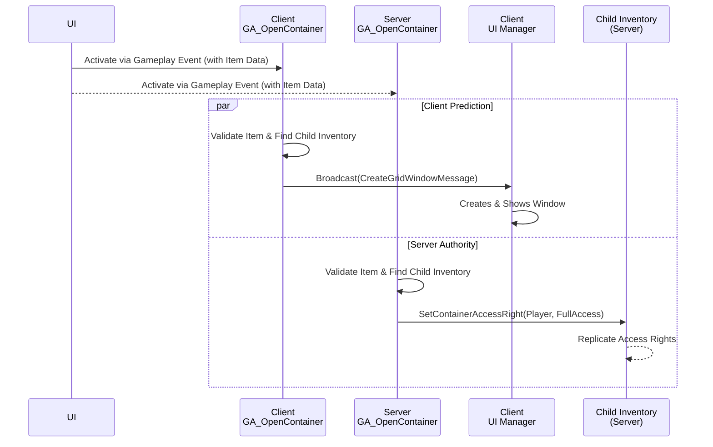
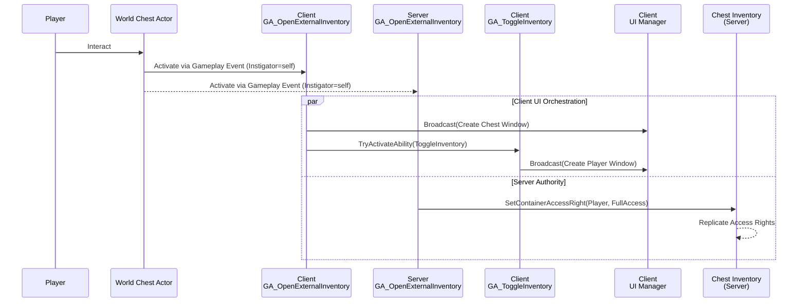

# Tetris Inventory Window Lifecycle

In a networked game, managing the UI for a spatial inventory requires a secure and responsive approach. This page outlines the robust pattern used by the Tetris Inventory plugin to manage the opening and closing of inventory windows, leveraging the Gameplay Ability System (GAS) for client prediction and server-side validation.

### The Core Pattern: Predictive Open, Authoritative Access

The system is built on a sophisticated client-predicted model to ensure a snappy user experience while maintaining server authority.

1. **Request via GAS (UI → Client/Server):** A player interaction triggers a single **Gameplay Event**. This event activates a Gameplay Ability simultaneously on the requesting client and the server.
2. **Predictive Open (Client):** The client's version of the ability first performs **local validation** to see if the inventory can be opened from its perspective. If it can, it immediately broadcasts a local **Gameplay Message** to its own UI system, commanding the window to open. This provides instant visual feedback.
3. **Authoritative Access (Server):** The server's version of the ability performs its own validation. Its primary job is not to open the window, but to grant the player the necessary **Access Rights** to the container's inventory.
4. **Interaction Validation (Server):** When the player later tries to move an item within the new window, the server can validate this action because the player has already been granted the required access.

This ensures the UI opens instantly, while the server retains full control over permissions and subsequent item manipulations.

***

### Opening a Container Window

There are two primary scenarios for opening a Tetris inventory window: opening an inventory contained _within an item_ (like a backpack), and opening a _standalone external inventory_ (like a world chest).

#### Example 1: Opening a Container Item (e.g., a Backpack)

This flow is used when the inventory is a component of a `ULyraInventoryItemInstance`.

**1. The UI Request**\
The player interacts with a container item. The UI sends a Gameplay Event (e.g., `Event.Inventory.RequestOpenContainer`) with an `FAbilityData_SourceItem` struct to identify the target item.

**2. Ability Activation (Client & Server)**\
The `GA_Inventory_OpenContainer` ability activates on both the client that made the request and on the server.

**3. Local Validation & Predictive Open (Client-Side Logic)**\
The client's ability immediately performs local checks:

* It resolves the `FAbilityData_SourceItem` to find the local `ULyraInventoryItemInstance`.
* It checks if the item instance is valid and has the required `FTransientFragmentData_Container`.
* This pre-check prevents sending a pointless request to the server if the item has already been removed from the client's perspective.

If local validation passes, the client broadcasts the `FCreateTetrisInventoryWindowMessage` locally to its UI Manager, which creates and displays the window instantly. If the client's prediction is wrong (e.g., the item was just removed), it's harmless; the server will not grant `Access Rights`, so any attempted interaction with the phantom window will be rejected.

**4. Authoritative Access Grant (Server-Side Logic)**\
Simultaneously, the server's ability performs its security role:

* It resolves the item and finds its `ChildInventory`.
* It calls **`Set Container Access Right`** on the inventory's `Permission Component`, granting the requesting player **`FullAccess`**.

Granting `FullAccess` is the master key. It allows the server to consider subsequent permission checks (`MoveItems`, `TakeItems`, etc.). If a player only has `ReadOnly` or `NoAccess`, the inventory's contents might not even replicate to them, and any interaction requests would be denied immediately.

#### Example 2: Opening an External Inventory (e.g., a World Chest)

This workflow is common for world containers like chests or lootable bodies. The goal is to open both the external inventory's UI and the player's own inventory UI simultaneously, creating a seamless looting experience where the player can drag and drop items between the two.

**1. The Interaction & Request**\
The player interacts with an actor in the world (e.g., a chest). An interaction system triggers a Gameplay Event. The `Instigator` of this event is the chest actor itself.

**2. Ability Activation**\
An ability like `GA_OpenExternalInventory` activates on both the client and server.

**3. Predictive UI Actions (Client-Side Logic)**\
The client's version of the ability acts immediately to orchestrate the creation of _both_ UI windows:

* **A. Open External Window:** The ability first gets the `ULyraTetrisInventoryManagerComponent` from the `Instigator` actor (the chest). It validates that the component exists and then broadcasts the `FCreateTetrisInventoryWindowMessage` to its local UI Manager, commanding it to create and display the chest's inventory window.
* **B. Open Player's Window:** Immediately after, the ability calls `Try Activate Ability By Class` to trigger the player's separate `GA_ToggleInventory` ability. This ability is responsible for opening (or closing) the player's main inventory window.

The result is that the player sees both their own backpack and the chest's contents appear on screen at the same time, ready for interaction.

**4. Authoritative Access Grant (Server-Side Logic)**\
While the client is setting up the UI, the server's version of `GA_OpenExternalInventory` performs the critical security step:

* It gets the chest's inventory component from the `Instigator`.
* It calls **`Set Container Access Right`** on the chest's inventory, granting the requesting player **`FullAccess`**.

This server-side action is what authorizes the player to perform subsequent actions like moving items from the chest into their own inventory. Without this step, the predictively opened UI would be non-functional, as any interaction attempt would be rejected by the server.

***

### Closing a Container Window

**Client-Initiated Close (User Action)**

For simple UI interactions like pressing 'Esc' or a close button, the widget can simply be removed from its parent without server interaction.

***

### Supporting Message Payloads

* **`FCreateTetrisInventoryWindowMessage`**\
  Sent locally on the client to trigger the predictive creation of a window.
  * `NewInventory`: The `ULyraTetrisInventoryManagerComponent` to display.
  * `InventoryItemOwnerDefinition`: The definition of the item that owns the inventory (if applicable).
  * `PlayerController`: The local player who will view the window.
* **`FDestroyTetrisInventoryWindowMessage`**\
  Broadcast from the server to command the closing of a specific window on relevant clients.
  * `Inventory`: Identifies the `ULyraTetrisInventoryManagerComponent` whose UI window must be closed.
  * `PlayerController`: Can be used for filtering if needed.
