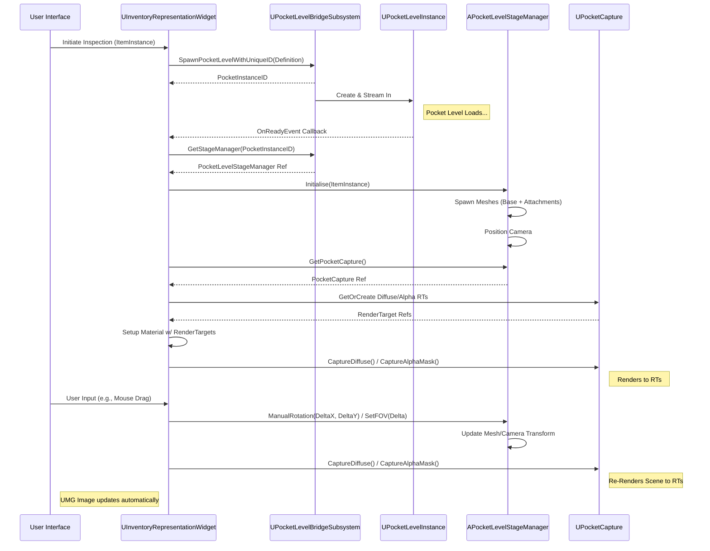
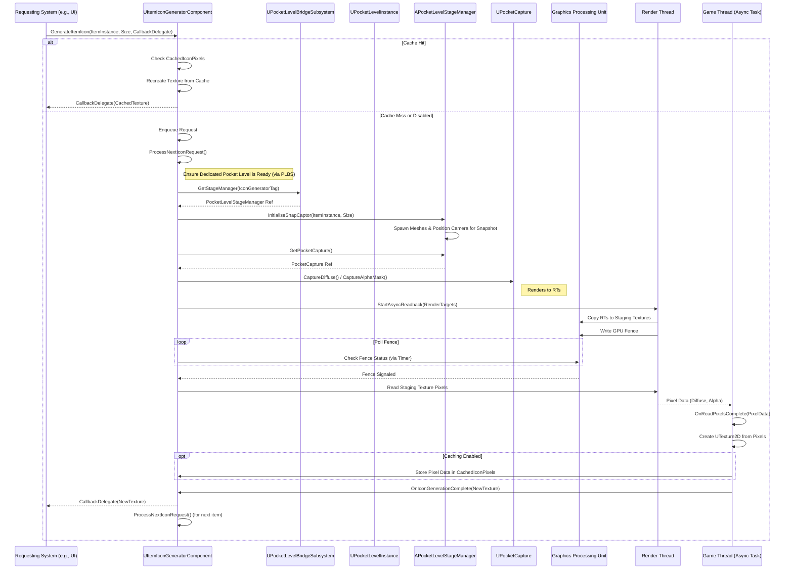

# Item Inspection System

### Purpose: Beyond 2D Icons

While standard 2D icons serve a basic purpose in inventory systems, providing users with a detailed, interactive 3D representation of their items significantly enhances the experience. This system, integrated within the Tetris Inventory Plugin, offers two key features built upon a common foundation:

1. **Live Item Inspection:** Allows players to view and interact with (rotate, zoom) a high-fidelity 3D model of an item, including any currently applied attachments, directly within the UI.
2. **Dynamic Icon Generation:** Leverages the same 3D rendering setup to asynchronously generate high-quality static 2D icons for items. **This is particularly powerful for items whose appearance can change dynamically during gameplay** – for example, weapons with different attachments applied. The system can generate an icon that accurately reflects the item's _current_ state, rather than relying on a single, generic pre-made icon. These generated icons can then be used in inventory slots, tooltips, or other UI elements.

This approach provides a richer understanding and appreciation of item visuals, crucial for games where gear appearance and customization are important.

### Leveraging Unreal Engine's PocketWorlds

To achieve this detailed 3D rendering without interfering with the main game world's rendering performance or visual state, the system utilizes Unreal Engine's **PocketWorlds** plugin.

**Core PocketWorlds Concepts:**

* **Isolation:** PocketWorlds allow for streaming small, separate Levels (`UPocketLevel`) into the main game world, typically positioned far away or in an isolated coordinate space. This ensures the inspection/rendering scene doesn't visually clash or share rendering resources directly with the player's current view of the game world.
* **Dedicated Environments:** Each pocket world can contain its own actors, lighting, post-processing, and scene capture components, allowing for a controlled environment tailored specifically for rendering items.
* **Scene Capture:** `USceneCaptureComponent2D` components (`UPocketCapture` in this system's context) are used within the pocket world to render specific actors onto `UTextureRenderTarget2D` assets. These render targets can then be used as textures within UMG widgets.
* **Management:** Engine subsystems (`UPocketLevelSubsystem`, `UPocketCaptureSubsystem`) manage the lifecycle (creation, streaming, destruction) of these pocket levels and their capture components.

### High-Level Workflow

The general process for both live inspection and icon generation follows these steps:

1. **Trigger:** An action (e.g., UI button click for inspection, an internal request for icon generation) initiates the process for a specific `ULyraInventoryItemInstance`.
2. **Pocket Level Management:** The custom `UPocketLevelBridgeSubsystem` is requested to provide access to a suitable pocket level instance (identified by `UIdentifyingPocketLevel`). It handles spawning, retrieving, and managing the streaming state of these levels.
3. **Staging:** An `APocketLevelStageManager` actor _within_ the pocket level receives the item instance. It spawns the item's 3D mesh and recursively spawns/attaches meshes for any attached items based on configuration (`InventoryFragment_Inspect`, `InventoryFragment_Attachment`). It also positions an internal camera.
4. **Rendering/Capture:** The `APocketLevelStageManager` uses an associated `UPocketCapture` component to render the staged item(s) from its camera's perspective onto one or more `UTextureRenderTarget2D`s.
5. **Output:**
   * **For Live Inspection:** A `UInventoryRepresentationWidget` displays the render target's texture in the UI and forwards player input (mouse drag/wheel) back to the `APocketLevelStageManager` for interactive control.
   * **For Icon Generation:** The `UItemIconGeneratorComponent` performs an asynchronous GPU readback of the render target's pixel data, creates a static `UTexture2D` from it, and notifies the requesting system via a delegate.











### Key Custom Components

This system introduces several custom classes that build upon or interact with the base PocketWorlds functionality:

* **`UIdentifyingPocketLevel`**: A simple Data Asset inheriting `UPocketLevel`, adding a `FGameplayTag` for easier identification and management by the bridge subsystem.
* **`UPocketLevelBridgeSubsystem`**: A crucial custom subsystem that abstracts and manages the creation, tracking (by Tag or unique ID), and lifecycle of pocket level instances specifically for inventory inspection/icon generation purposes.
* **`APocketLevelStageManager`**: An Actor placed within the pocket level responsible for spawning, arranging, and controlling the 3D representation of the item being viewed.
* **`UInventoryRepresentationWidget`**: The UMG widget responsible for displaying the live render target and handling user interaction for inspection.
* **`UItemIconGeneratorComponent`**: **`UItemIconGeneratorComponent`**: A component handling the asynchronous generation and caching of static 2D icons using the PocketWorlds setup. **Its main benefit lies in creating accurate snapshots for items whose visuals change (e.g., due to attachments), ensuring UI icons stay representative of the item's current state.**

### Structure of this Section

The following pages will delve into the details of these key components and concepts:

* **PocketWorlds:** Focuses on the `UPocketLevelBridgeSubsystem` and `UIdentifyingPocketLevel`.
* **APocketLevelStageManager:** Details the actor controlling the scene inside the pocket level.
* **UInventoryRepresentationWidget:** Explains the live inspection UI widget.
* **UItemIconGeneratorComponent:** Covers the asynchronous static icon generation process.
