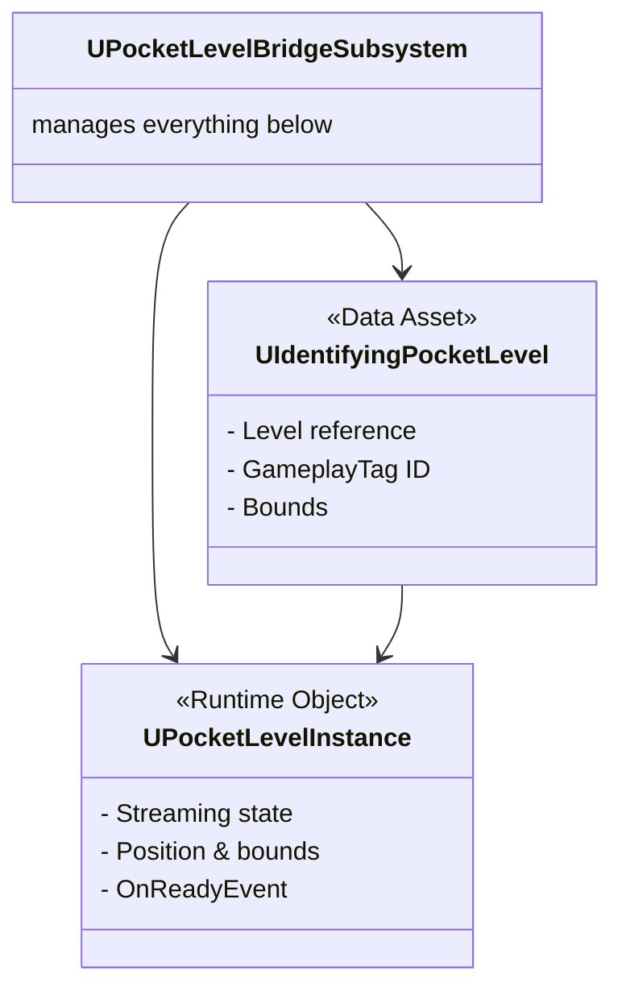

# Pocket Level Management

Imagine you need to render a weapon in perfect isolation -- controlled lighting, no other actors interfering, no risk of the main game camera catching a stray mesh floating in the sky. That is exactly what pocket levels provide: small, self-contained levels streamed into the world at a far-off location, purpose-built for rendering items.

This page covers the three classes that make pocket level management work: the **definition** asset, the **runtime instance**, and the **bridge subsystem** that ties them together.



***

### `UIdentifyingPocketLevel` (Data Asset)

This Data Asset defines a _type_ of pocket world. You create one in the Content Browser for each distinct rendering environment you need.

**Inherits from:** `UPocketLevel` (provided by the PocketWorlds plugin)

**What it adds:** A single `FGameplayTag` property,  `IdentifingGameplayTag`, that gives each pocket level definition a unique identity (e.g., `PocketWorld.Inventory.Inspection`). The bridge subsystem uses this tag to request, track, and retrieve specific pocket worlds.

**Properties:**

| Property                | Type                     | Purpose                                        |
| ----------------------- | ------------------------ | ---------------------------------------------- |
| `Level`                 | `TSoftObjectPtr<UWorld>` | The Unreal Engine Level (`.umap`) to stream in |
| `Bounds`                | `FBox`                   | Bounding information for the level             |
| `IdentifingGameplayTag` | `FGameplayTag`           | Unique tag for lookup and management           |


Create one `UIdentifyingPocketLevel` asset per use case. For example, you might have one tagged `PocketWorld.Inventory.Inspection` for live previews and reuse it for icon generation, or create separate definitions if they need different lighting setups.


***

### `UPocketLevelInstance` (Runtime Object)

While the Data Asset is the _blueprint_, `UPocketLevelInstance` is the _living instance_, a runtime object that represents a single streamed pocket level in the game world.

**Key responsibilities:**

* Holds references to the owning `ULocalPlayer` and the `UPocketLevel` definition it was spawned from
* Manages the underlying `ULevelStreamingDynamic` object that handles actual level streaming
* Tracks the instance's position and bounds in the world
* Broadcasts the `OnReadyEvent` when fully loaded and visible

<details>

<summary>Lifecycle details</summary>

**Initialize** - Links the instance to the player, definition, and spawn point. Initiates level streaming via `ULevelStreamingDynamic::LoadLevelInstanceBySoftObjectPtr`.

**StreamIn() / StreamOut()** - Controls the visibility and loading state of the associated level.

**HandlePocketLevelLoaded()** - Internal callback when the level finishes loading. Performs setup such as setting `bClientOnlyVisible` and adjusting actor ownership/roles within the loaded level for correct client-side behavior.

**HandlePocketLevelShown()** - Internal callback when the level becomes visible. This is what triggers the `OnReadyEvent`.

</details>

**The event that matters most:**

```cpp
// Multicast delegate - fires when the level is loaded AND visible
FPocketLevelInstanceEvent OnReadyEvent;
```

Systems like `UInventoryRepresentationWidget` and `UItemIconGeneratorComponent` listen to this event to know when it is safe to interact with actors inside the pocket level.

***

### `UPocketLevelBridgeSubsystem` (Management Hub)

This `UWorldSubsystem` is the primary interface for the entire Item Inspection System's pocket level needs. It wraps the lower-level engine subsystems and provides purpose-built methods for spawning, tracking, and cleaning up pocket worlds.

#### Spawning Pocket Levels

The bridge subsystem offers two spawning strategies depending on whether you need a **shared** or **unique** instance:

<table><thead><tr><th width="278.3333740234375">Method</th><th>When to Use</th><th>Tracking</th></tr></thead><tbody><tr><td><code>SpawnPocketLevel(Player, Definition, Location)</code></td><td>Shared/singleton pocket worlds (e.g., icon generator)</td><td>By <code>FGameplayTag</code></td></tr><tr><td><code>SpawnPocketLevelWithUniqueID(Player, Definition, Location)</code></td><td>Independent instances (e.g., each inspection widget gets its own)</td><td>By unique <code>int32</code> ID</td></tr></tbody></table>


`SpawnPocketLevel` may reuse an existing instance if one with the same tag already exists for the player. `SpawnPocketLevelWithUniqueID` always creates a new, independent instance, use this when multiple inspection windows can be open simultaneously.


#### Lifecycle Control

```cpp
// Stream in/out by tag or unique ID
StreamInLevel(FGameplayTag Tag);
StreamInLevel(int32 UniqueID);
StreamOutLevel(FGameplayTag Tag);
StreamOutLevel(int32 UniqueID);

// Destroy and clean up
DestroyPocketLevelInstance(FGameplayTag Tag);
DestroyPocketLevelInstance(int32 UniqueID);
```

`DestroyPocketLevelInstance` handles the full teardown: streaming out, telling the base `UPocketLevelSubsystem` to destroy the instance, marking it for destruction, and removing it from internal tracking maps.

#### Accessing Content Inside the Pocket Level

```cpp
// Get the raw instance
UPocketLevelInstance* GetPocketLevelInstance(FGameplayTag Tag);
UPocketLevelInstance* GetPocketLevelInstance(int32 UniqueID);

// Get the stage manager directly (convenience)
APocketLevelStageManager* GetStageManager(FGameplayTag Tag);
APocketLevelStageManager* GetStageManager(int32 UniqueID);
```

`GetStageManager` is the function you will use most. It retrieves the `UPocketLevelInstance`, searches within its loaded level for the `APocketLevelStageManager` actor, and returns it, saving you from manually iterating through actors.

***

### Putting It All Together



#### Define Your Pocket Worlds

Create `UIdentifyingPocketLevel` Data Assets in the Content Browser. Assign the Level (`.umap`) and a unique `IdentifingGameplayTag` to each.



#### Spawn an Instance

Use `UPocketLevelBridgeSubsystem` to spawn instances, `SpawnPocketLevel` for shared singletons, `SpawnPocketLevelWithUniqueID` for independent instances.



#### Wait for Ready

The bridge subsystem creates and tracks `UPocketLevelInstance` objects. Listen to `OnReadyEvent` to know when the level is fully loaded and visible.



#### Access the Stage Manager

Call `UPocketLevelBridgeSubsystem::GetStageManager` with your tag or ID to get the `APocketLevelStageManager` inside the pocket level. From there, you can stage items for rendering.



#### Clean Up

Call `UPocketLevelBridgeSubsystem::DestroyPocketLevelInstance` when the pocket world is no longer needed. The subsystem handles streaming out, destruction, and internal bookkeeping.



This layered approach, definition, instance, subsystem, keeps pocket level management organized and predictable, even when multiple inspection windows and an icon generator are all running at the same time.
