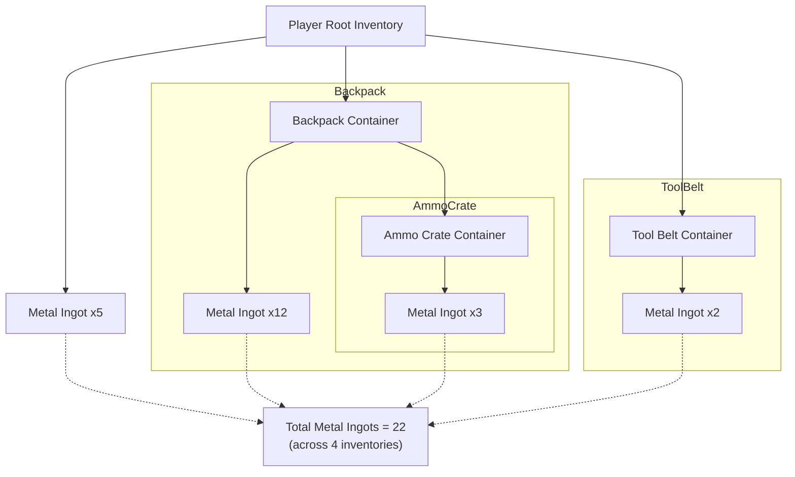
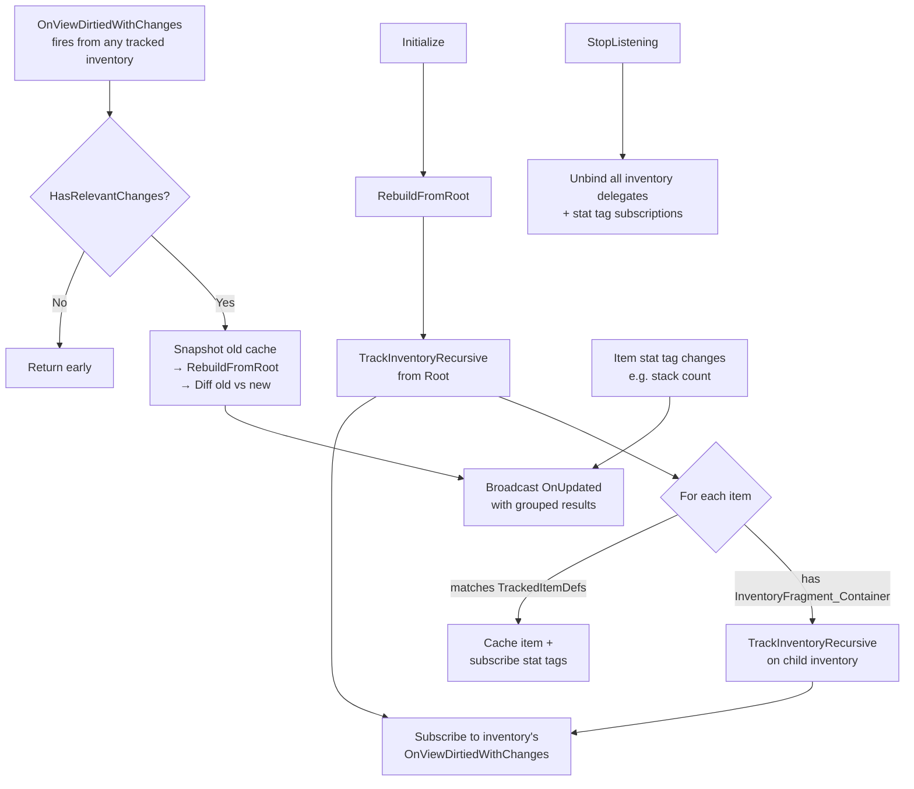

# Querying Items in Tetris Inventories

Your crafting UI needs to show how many metal ingots the player has, but they could be in the main backpack, a tool belt, or a nested ammo crate inside the backpack. Manually searching every container on every change isn't going to scale.

The Tetris Inventory Query system solves this with **reactive, hierarchical tracking**, you tell it what item types you care about, point it at a root inventory, and it automatically monitors every nested container underneath.

***

### Why Hierarchical Querying Matters

A flat inventory is straightforward to query. But the moment items live inside containers, which live inside other containers, you have a tree:



Polling every level of this tree whenever you need a count is wasteful. Even worse, containers can be added or removed at any time, a player drops a backpack, picks up a crate, or moves items between containers. The Tetris query system discovers child inventories automatically, binds to each one's `OnViewDirtiedWithChanges` delegate, and aggregates results across the entire hierarchy.

<details>

<summary>Internals</summary>




</details>


This system extends the base [Item Query System](../../base-lyra-modified/inventory/item-query-system.md). The Tetris variant adds recursive container discovery and grouped-by-inventory results on top of the same reactive delegate pattern.


***

### C++ - `ULyraTetrisInventoryQuery`

The API mirrors the base `ULyraInventoryQuery`. Create it as a `UPROPERTY` member, call `Initialize` with tracked definitions and the root inventory, and bind to the update delegate. The key difference: results come back **grouped by inventory**, so you know exactly which container holds which items.

<details>

<summary>Example 9 crafting component tracking Wood and Metal</summary>

```cpp
UPROPERTY()
TObjectPtr<ULyraTetrisInventoryQuery> ResourceQuery;

void UCraftingSystemComponent::InitializeResourceTracking()
{
    ULyraInventoryManagerComponent* PlayerRootInventory =
        ULyraInventoryManagerComponent::FindInventoryComponent(GetOwner());

    if (!PlayerRootInventory) return;

    TArray<TSubclassOf<ULyraInventoryItemDefinition>> ResourceItemDefs;
    ResourceItemDefs.Add(UResource_Wood::StaticClass());
    ResourceItemDefs.Add(UResource_Metal::StaticClass());

    ResourceQuery = NewObject<ULyraTetrisInventoryQuery>(this);
    ResourceQuery->Initialize(ResourceItemDefs, PlayerRootInventory);
    ResourceQuery->OnUpdated.AddDynamic(
        this, &UCraftingSystemComponent::HandleResourceQueryUpdate);

    UpdateAvailableRecipes(ResourceQuery->GetItemsGroupedByInventory());
}

void UCraftingSystemComponent::HandleResourceQueryUpdate(
    const TArray<FLyraTetrisInventoryQueryResult>& ItemsByInventory)
{
    UpdateAvailableRecipes(ItemsByInventory);
}

void UCraftingSystemComponent::EndPlay(const EEndPlayReason::Type EndPlayReason)
{
    if (ResourceQuery)
    {
        ResourceQuery->StopListening();
    }
    Super::EndPlay(EndPlayReason);
}
```

</details>

#### Accessors

| Method                         | Returns                                           | Use when...                                                                                   |
| ------------------------------ | ------------------------------------------------- | --------------------------------------------------------------------------------------------- |
| `GetItemsGroupedByInventory()` | `TArray<FLyraTetrisInventoryQueryResult>`         | You need to know _which_ inventory holds _which_ items (per-container UI breakdowns)          |
| `GetItems()`                   | `TArray<ULyraInventoryItemInstance*>`             | You just need a flat total regardless of location ("does the player have 10 metal anywhere?") |
| `GetTrackedItemDefs()`         | `TSet<TSubclassOf<ULyraInventoryItemDefinition>>` | You need to inspect what the query is tracking                                                |

`FLyraTetrisInventoryQueryResult` contains:

* `Inventory` - the `ULyraInventoryManagerComponent*` where items were found
* `Items` - `TArray<ULyraInventoryItemInstance*>` of matching items within that specific inventory
* `TotalCount` - pre-calculated sum of `Lyra.Inventory.Item.Count` stat tags across all items in this inventory. Use this directly instead of looping through `Items` to sum counts yourself

***

### Blueprint - `UAsyncAction_TetrisItemQuery`

The `QueryTetrisInventoryAsync` node wraps the C++ query for Blueprint use. It manages the underlying query's lifecycle automatically.

| Output Pin          | When It Fires                                     | Data                                   |
| ------------------- | ------------------------------------------------- | -------------------------------------- |
| **On First Result** | Once, immediately after initialization            | `Items By Inventory` (grouped results) |
| **On Updated**      | Every subsequent change anywhere in the hierarchy | `Items By Inventory` (grouped results) |
| **On Failed**       | If initialization fails (e.g., null inventory)    | -                                      |


Both output pins provide an array of `FLyraTetrisInventoryQueryResult`. Loop through the outer array for per-container breakdowns, or flatten and sum for a single total.


Store the return value to call `Cancel()` when you no longer need tracking.

<details>

<summary>Blueprint example - Inventory Ammo resource counter</summary>

<figure><figcaption></figcaption></figure>

The graph passes the player's root inventory and tracked resource definitions to `QueryTetrisInventoryAsync`, then wires both **On First Result** and **On Updated** to the same handler that iterates the grouped results, sums `Lyra.Inventory.Item.Count` stat tags per definition, and updates the UI text blocks.

</details>

***
