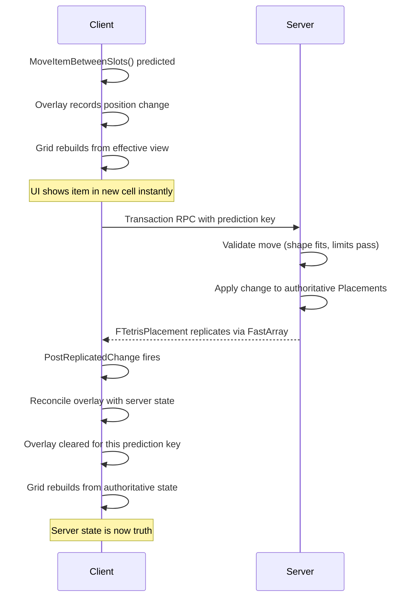

# Client Prediction

You drag an ammo stack from cell (2,3) to cell (5,1). It moves instantly on your screen,even though the server hasn't confirmed the move yet. If something goes wrong, it snaps back. How does a grid-based inventory stay responsive across the network?

The Tetris Inventory Manager uses GUID-keyed client prediction. Every item carries a stable GUID that persists identically on both client and server, giving the prediction engine a reliable anchor to track operations, reconcile state, and roll back cleanly when needed.

***

### The Overlay Model

Prediction works through "overlays", client-side modifications layered on top of the replicated server state. The key function is `GetPlacements()`, and what it returns depends on who is asking:

```
GetPlacements() returns:
┌─────────────────────────────────┐
│   Server Placements (replicated)│
│ + Overlay Adds    (predicted)   │
│ - Overlay Removes (predicted)   │
│ ~ Overlay Changes (predicted)   │
└─────────────────────────────────┘
```

| Caller            | What GetPlacements() Returns                                                                               |
| ----------------- | ---------------------------------------------------------------------------------------------------------- |
| **Server**        | Raw authoritative placements, no predictions                                                               |
| **Owning Client** | Server state + prediction overlay = the effective view                                                     |
| **Other Clients** | Same as server, non-owners have none of your prediction overlays, they only have their prediction overlays |

This means UI code never needs to track predictions separately. Call `GetPlacements()` and you always get the correct visual state for the current context.


Never access `Placements` directly from outside the component. Always go through `GetPlacements()` to get the prediction-aware effective view.


***

### Single-Layer Prediction

Some inventory systems split prediction into multiple layers, one for item existence, another for position. The Tetris Inventory uses **single-layer prediction**: both item existence and grid position are tracked in one prediction layer.

The prediction traits (`FGuidKeyedTetrisPositionTraits`) manage both the `Placements` array (grid positions) and the `InventoryList` array (item entries) together. When a predicted add happens, the item appears in both arrays atomically. When a predicted move happens, both arrays update in lockstep.

#### Why Single-Layer?

In a grid inventory, an item's position **is** its identity within the container. You cannot meaningfully have an item "exist" in the inventory without knowing where it sits in the grid. Splitting these into separate prediction layers would create intermediate states where an item exists but has no position, breaking grid queries and UI rendering.

***

### Timeline of a Move Operation

Here is what happens when you drag an item from one cell to another:



The grid always rebuilds from the effective view via `RebuildGridFromEffectiveView()`. During the prediction window, the effective view is server state plus overlays. After reconciliation, the effective view is pure server state. The grid doesn't care which, it rebuilds the same way every time.

***

### Reconciliation

Two callbacks handle the transition from predicted state back to authoritative state:

#### `OnPredictionKeyCaughtUp`

Called when the server has finished processing the prediction. The overlay entries for that prediction key are cleared, and the grid rebuilds from the now-authoritative state. This is the normal success path, the server agreed with what the client predicted.

#### `OnPredictionKeyRejected`

Called when the prediction was invalid, perhaps another player grabbed the item first, or a weight limit was exceeded on the server. The overlay is discarded and the grid rebuilds to the authoritative state. From the player's perspective, the item snaps back to where it was.

Both callbacks trigger `RebuildGridFromEffectiveView()`, ensuring the grid always reflects the correct state.


Rejection is seamless. Because the grid always rebuilds from the effective view, rolling back a prediction is just removing the overlay and rebuilding, the same operation as confirmation, just with different data.


***

### View Dirtied Delegates

When the effective view changes, whether from a new prediction, a reconciliation, or a server replication event, delegates fire so subscribers can react:

```cpp
// Subscribe to grid changes (lightweight — no change details)
Manager->GetOnViewDirtied()->AddUObject(this, &UMyClass::HandleGridChange);

// Subscribe with detailed change info (which items changed and how)
Manager->GetOnViewDirtiedWithChanges()->AddUObject(this, &UMyClass::HandleDetailedChange);
```

These delegates fire after `RebuildGridFromEffectiveView()` completes, so by the time your handler runs, the grid cells are already up to date.

#### Blueprint Events

The same notifications are available as Blueprint-assignable events on the component:

| Event                                 | Description                                                                       |
| ------------------------------------- | --------------------------------------------------------------------------------- |
| `OnTetrisInventoryChanged`            | Fires when the effective view changes for any reason                              |
| `OnTetrisInventoryChangedWithDetails` | Same, but includes an array of `FViewDirtiedChange` describing each affected item |

Use `OnTetrisInventoryChanged` for simple "refresh everything" UI patterns. Use `OnTetrisInventoryChangedWithDetails` when you need to animate specific items (e.g., highlighting a newly added stack or sliding a moved item).


For UI, prefer using [ViewModels](../tetris-inventory-ui/tetris-view-model.md) over raw delegates. ViewModels handle prediction complexity for you and provide clean data binding.


***

### The Prediction Payload

Every predicted operation carries a payload that describes the item and its grid position:

```cpp
struct FGuidKeyedTetrisPositionPayload
{
    ULyraInventoryItemInstance* Item;     // The item instance
    FGuid ItemGuid;                       // Stable GUID for reconciliation
    int32 ClumpID;                        // Which grid section
    FIntPoint RootSlot;                   // Top-left cell of the item's shape
    EItemRotation Rotation;               // Current rotation state
};
```

The `ItemGuid` is what makes this work across the network. When the server replicates a change, the client matches it to the predicted overlay by GUID, not by pointer, not by array index. GUIDs survive replication, prediction, and reconciliation.

***


For the complete prediction model shared across all container types (Inventory, Equipment, and Tetris), see [Prediction Architecture](../../../base-lyra-modified/item-container/prediction/prediction-architecture.md).


***

<details>

<summary>Prediction Traits Deep Dive</summary>

`FGuidKeyedTetrisPositionTraits` is the bridge between the generic prediction engine and the Tetris inventory's specific data structures. It tells the engine how to read, write, and reconcile Tetris placements.

**Key Responsibilities:**

| Method                | What It Does                                                                  |
| --------------------- | ----------------------------------------------------------------------------- |
| `DirectAddEntry`      | Adds to both `Placements` and `InventoryList` atomically                      |
| `DirectRemoveEntry`   | Removes from both `Placements` and `InventoryList`                            |
| `DirectChangeEntry`   | Updates position in `Placements` and `SlotIndex` in `InventoryList`           |
| `PayloadToSlotStruct` | Creates `FInventoryAbilityData_SourceTetrisItem` for the item's `CurrentSlot` |
| `PayloadToViewEntry`  | Converts predicted payload to a `FTetrisPlacement` for the effective view     |

**The Authority Split:**

On the server, `DirectAddEntry`, `DirectRemoveEntry`, and `DirectChangeEntry` modify the authoritative arrays directly. On the client, the same operations go through the overlay instead, the runtime handles this distinction automatically based on `IsAuthority()`.

**Single-Layer in Practice:**

When `DirectAddEntry` runs, it adds one entry to `Placements` (the grid position) and one to `InventoryList` (the item existence) in the same call. This is what "single-layer" means in practicem one traits struct manages both data structures, keeping them synchronized through every prediction and reconciliation cycle.

```cpp
static FServerEntry* DirectAddEntry(TOwner* Owner, const FPayload& Payload)
{
    // Add to Placements (grid position)
    FServerEntry NewEntry;
    NewEntry.Item = Payload.Item;
    NewEntry.ClumpID = Payload.ClumpID;
    NewEntry.RootSlot = Payload.RootSlot;
    NewEntry.Rotation = Payload.Rotation;
    Owner->Placements.Placements.Add(NewEntry);

    // Also add to InventoryList (item existence)
    const int32 SlotIndex = Owner->InventoryGrid.FindGridCellFromCoords(
        Payload.ClumpID, Payload.RootSlot);
    FLyraInventoryEntry& InvEntry = Owner->InventoryList.Entries.AddDefaulted_GetRef();
    InvEntry.Instance = Payload.Item;
    InvEntry.SlotIndex = SlotIndex;
    Owner->InventoryList.MarkArrayDirty();

    return &Owner->Placements.Placements.Last();
}
```

</details>
