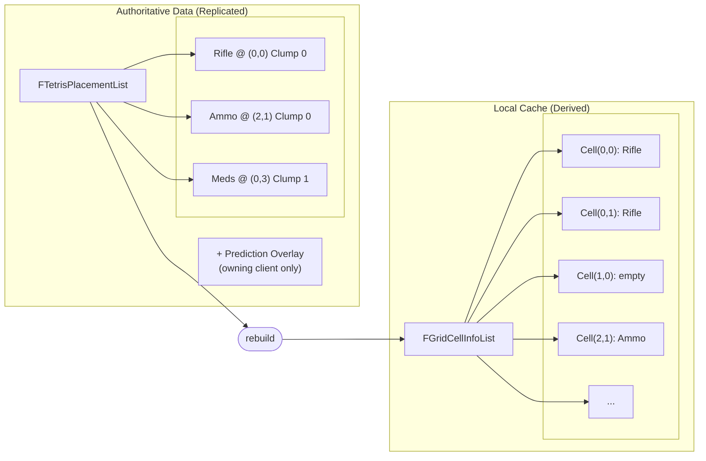

# The Grid System

Every Tetris inventory is a 2D grid, but rarely a plain rectangle. Player backpacks might be 8x6. A vest has two narrow columns. A weapon case is an L-shape. The grid system supports all of these through **clumps**, and keeps everything synchronized through a **dual-data architecture** that cleanly separates replicated authority from local rendering state.

***

### The Clump Concept

A grid is built from one or more **clumps**, independent rectangular sections, each with its own coordinate space. Think of clumps as separate panels that together form the complete inventory shape.

```
Single Clump (simple 4x3 backpack):        Two Clumps (backpack with a pounch):

  Clump 0                                    Clump 0           Clump 1
  ┌──┬──┬──┬──┐                              ┌──┬──┬──┬──┐    ┌──┬──┐
  │  │  │  │  │                              │  │  │  │  │    │  │  │
  ├──┼──┼──┼──┤                              ├──┼──┼──┼──┤    ├──┼──┤
  │  │  │  │  │                              │  │  │  │  │    │  │  │
  ├──┼──┼──┼──┤                              ├──┼──┼──┼──┤    └──┴──┘
  │  │  │  │  │                              │  │  │  │  │
  └──┴──┴──┴──┘                              └──┴──┴──┴──┘
```

#### Key Rules

* Each clump has its own local coordinate system starting at (0, 0)
* Items must fit entirely within a single clump, they cannot span across clump boundaries
* Each clump is identified by a zero-based `ClumpID` (its index in the `InventoryLayout` array)
* You can use multiple clumps for equipment-style layouts: one large clump for the main bag, smaller clumps for quick-access slots


An item's position is always described by three values: `ClumpID`, `RootSlot` (the top-left coordinate within that clump), and `Rotation`. Together, these fully define where an item sits in the grid.


***

### `FInventoryLayoutCreator`

Each clump is defined by an `FInventoryLayoutCreator` struct. The component's `InventoryLayout` array holds one of these per clump.

```cpp
USTRUCT(BlueprintType)
struct FInventoryLayoutCreator
{
    // Origin offset (used for UI positioning of this clump)
    int32 ClumpX;
    int32 ClumpY;

    // 2D boolean grid: true = accessible cell, false = blocked
    TArray<F1DBooleanRow> ClumpGrid;
};
```

| Field       | Purpose                                                                                     |
| ----------- | ------------------------------------------------------------------------------------------- |
| `ClumpX`    | Horizontal origin offset for this clump (UI layout positioning)                             |
| `ClumpY`    | Vertical origin offset for this clump (UI layout positioning)                               |
| `ClumpGrid` | 2D array of booleans defining the shape, `true` marks an accessible cell, `false` blocks it |

<details>

<summary>Example: Simple Rectangle</summary>

A 4-wide, 3-tall backpack with every cell accessible:

```
ClumpX: 0, ClumpY: 0
ClumpGrid:
  Row 0: [true, true, true, true]
  Row 1: [true, true, true, true]
  Row 2: [true, true, true, true]

Resulting grid:
  ┌──┬──┬──┬──┐
  │  │  │  │  │  Row 0
  ├──┼──┼──┼──┤
  │  │  │  │  │  Row 1
  ├──┼──┼──┼──┤
  │  │  │  │  │  Row 2
  └──┴──┴──┴──┘
```

</details>

<details>

<summary>Example: L-Shape Using a Single Clump</summary>

You can create non-rectangular shapes within a single clump by setting cells to `false`:

```
ClumpX: 0, ClumpY: 0
ClumpGrid:
  Row 0: [true,  true,  true,  true ]
  Row 1: [true,  true,  true,  true ]
  Row 2: [true,  true,  false, false]
  Row 3: [true,  true,  false, false]

Resulting grid:
  ┌──┬──┬──┬──┐
  │  │  │  │  │  Row 0
  ├──┼──┼──┼──┤
  │  │  │  │  │  Row 1
  ├──┼──┼──┴──┘
  │  │  │        Row 2
  ├──┼──┤
  │  │  │        Row 3
  └──┴──┘
```

Items placed in this clump respect the boolean mask. A 2x2 item at position (2,0) fits; the same item at (2,1) does not because cells (2,2) and (3,2) are blocked.

</details>

<details>

<summary>Example: L-Shape Using Two Clumps</summary>

Alternatively, model the same shape as two separate rectangular clumps:

```
Clump 0 (4x2):                   Clump 1 (2x2):
  ClumpX: 0, ClumpY: 0             ClumpX: 0, ClumpY: 2
  ┌──┬──┬──┬──┐                    ┌──┬──┐
  │  │  │  │  │ Row 0              │  │  │ Row 0
  ├──┼──┼──┼──┤                    ├──┼──┤
  │  │  │  │  │ Row 1              │  │  │ Row 1
  └──┴──┴──┴──┘                    └──┴──┘
```

Both approaches produce the same visual L-shape, but the clump choice affects item placement. With two clumps, a 3x1 item can only go in Clump 0 (Clump 1 is only 2 wide). With a single clump, the same 3x1 item could theoretically span the full-width rows.

</details>


Use blocked cells within a single clump when items should be able to span the boundary region. Use separate clumps when the sections are logically independent (like a main bag and a side pouch).


***

### Dual-Data Architecture

This is the core design pattern of the Tetris grid. Two separate data structures serve two different purposes, and understanding the split is essential to working with the system.



```
Authoritative Data (Replicated)          Local Cache (Derived)
┌─────────────────────────────┐         ┌─────────────────────────┐
│   FTetrisPlacementList      │         │   FGridCellInfoList     │
│   ┌───────────────────────┐ │         │   ┌───────────────────┐ │
│   │ Rifle @ (0,0) Clump 0 │ │  ───>   │   │ Cell(0,0): Rifle  │ │
│   │ Ammo  @ (2,1) Clump 0 │ │ rebuild │   │ Cell(0,1): Rifle  │ │
│   │ Meds  @ (0,3) Clump 1 │ │         │   │ Cell(1,0): empty  │ │
│   └───────────────────────┘ │         │   │ Cell(2,1): Ammo   │ │
│                             │         │   │ ...               │ │
│   + Prediction Overlay      │         │   └───────────────────┘ │
│   (on owning client)        │         │                         │
└─────────────────────────────┘         └─────────────────────────┘
```







#### `FTetrisPlacement` + `FTetrisPlacementList` (Replicated)

This is the **authoritative data** - the source of truth for where items are positioned.

```cpp
struct FTetrisPlacement : public FFastArraySerializerItem
{
    // The item instance occupying this position
    ULyraInventoryItemInstance* Item;

    // Which clump the item is in
    int32 ClumpID;

    // Top-left coordinate within the clump
    FIntPoint RootSlot;

    // Current rotation of the item
    EItemRotation Rotation;

    // For client prediction reconciliation
    FContainerPredictionStamp Prediction;
};
```

The `FTetrisPlacementList` wraps these entries in an `FFastArraySerializer`, giving you delta replication (only changed placements sync) and built-in callbacks for add, change, and remove events.

| Callback                | When It Fires                           | What It Does                               |
| ----------------------- | --------------------------------------- | ------------------------------------------ |
| `PostReplicatedAdd`     | Server adds a new placement             | Reconciles with predictions, rebuilds grid |
| `PostReplicatedChange`  | Server modifies an existing placement   | Merges with predictions, rebuilds grid     |
| `PreReplicatedRemove`   | Server is about to remove a placement   | Cleans up predictions for this entry       |
| `PostReplicatedReceive` | Entire batch of replication is complete | Triggers final grid rebuild if needed      |

#### Querying Placements: `GetPlacements()`

`GetPlacements()` is the only way you should read placement data. It returns a **prediction-aware view**:

* **On the server:** Returns the raw `Placements.Placements` array directly, no predictions exist on the server.
* **On the owning client:** Returns server state merged with pending prediction overlays. If you dragged an item to a new position but the server hasn't confirmed yet, `GetPlacements()` already shows it in the new spot.
* **On non-owning clients:** Returns the server state as replicated, no predictions, no overlays.

This is what makes drag-and-drop feel instant. UI and ViewModels call `GetPlacements()` and always get the correct visual state without needing to know whether predictions are active.

***

#### `FGridCellInfoList` (Local Derived Cache)

The grid cell list is the **rendering-side data**. It is **never replicated**, instead, it is rebuilt locally from the effective view every time placements change.

```cpp
struct FGridCellInfo
{
    FIntPoint Position;                    // Cell coordinate within its clump
    EItemRotation Rotation;                // Rotation of the item occupying this cell
    ULyraInventoryItemInstance* ItemInstance;  // The item here (nullptr if empty)
    int32 ClumpID;                         // Which clump this cell belongs to
    FIntPoint RootSlot;                    // Points to the item's root cell
    FGameplayTagContainer SlotTags;        // Per-cell tags for slot-specific logic
};
```

The `FGridCellInfoList` contains:

* A flat `TArray<FGridCellInfo>` covering every accessible cell across all clumps
* A `GridCellIndexMap` for `O(1)` coordinate lookup: `[ClumpID][Row][Col]` maps to the flat array index
* A cached copy of the layout for change detection

#### Rebuild Flow

Every time the effective view changes, whether from replication, prediction, or rollback, the grid is rebuilt:



**Clear**

All existing cell occupancy data is cleared. The grid structure (accessible vs blocked cells) remains intact.



**Read effective view**

`GetPlacements()` returns the prediction-aware placement list.



**Populate cells**

For each placement, the item's shape (from its `InventoryFragment_Tetris`) is applied at the specified `RootSlot` with the specified `Rotation`. Every cell the item covers gets its `ItemInstance`, `RootSlot`, and `Rotation` set.



**Notify**

The `OnViewDirtied` delegate fires, telling ViewModels and UI to refresh.



<details>

<summary>Why the Grid Is Derived, Not Replicated</summary>

You might wonder why the grid isn't just replicated directly. Three reasons:

**1. Prediction correctness.** The effective view combines server state with client predictions. If the grid were replicated, it would show server state on the owning client, meaning a dragged item would snap back to its old position until the server confirmed. By deriving the grid from `GetPlacements()`, the grid always shows the predicted state on the owning client and the authoritative state on everyone else.

**2. Bandwidth efficiency.** A 10x8 grid has 80 cells. Replicating 80 `FGridCellInfo` structs every time any item moves would be wasteful. Instead, only the compact `FTetrisPlacement` entries replicate (one per item, not one per cell), and each client rebuilds the full grid locally.

**3. Single source of truth.** If both placements and grid cells were replicated independently, they could drift out of sync during packet loss or reordering. Deriving the grid from placements guarantees consistency, the grid is always a pure function of the current effective view.

</details>

***

### Coordinate Lookup

The `GridCellIndexMap` provides efficient coordinate-to-index resolution. Instead of scanning the flat cell array to find a specific cell, you index directly:

```
GridCellIndexMap[ClumpID][Row][Col]  -->  index into GridCells[]
```

This is an `TArray<FInventoryClumpIndexMapping>` where each entry is a 2D integer grid matching the clump dimensions. The integer at each position is the index into the flat `GridCells` array, or -1 for blocked cells.

```
Example: Clump 0 is 3x2

  GridCellIndexMap[0]:
    Row 0: [ 0,  1,  2 ]     GridCells[0] = Cell(0,0)
    Row 1: [ 3,  4,  5 ]     GridCells[3] = Cell(0,1)
                               ...and so on
```

This means `FindGridCellFromCoords(ClumpID, Position)` is an `O(1)` bounds check + array lookup rather than a linear scan. This matters when placement validation checks dozens of cells per frame during drag operations.

***

### Putting It Together

Here is how the pieces connect end-to-end when a player drags an item to a new position:



**Client predicts**

The owning client records a prediction overlay moving the item's `FTetrisPlacement` to the new `ClumpID`, `RootSlot`, and `Rotation`.



**Grid rebuilds locally**

`RebuildGridFromEffectiveView()` fires. `GetPlacements()` returns server state + the prediction overlay. The grid now shows the item in its new position.



**Server validates**

The server receives the transaction RPC, checks spatial constraints, weight limits, and permissions. If valid, the authoritative `FTetrisPlacement` is updated.



**Replication arrives**

`PostReplicatedChange` fires on the owning client. The prediction overlay is reconciled with the server state and cleared. The grid rebuilds one final time from pure server state.



**Non-owning clients update**

Other clients receive the replicated placement change. Their grids rebuild from the new server state directly, no predictions involved.



The player sees the item move instantly. The server remains authoritative. Other players see it move when replication arrives. The grid is always consistent because it is always derived from the current effective view.
