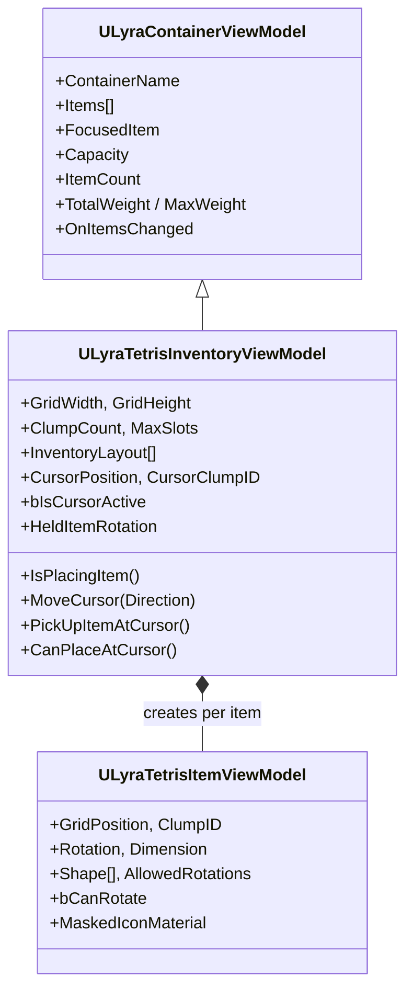

# Tetris View Model

You move the cursor to cell (3,2) and see a medkit highlighted. You pick it up, now every cell it occupied becomes empty, a ghost preview follows the cursor showing the item's shape, and the placement mode switches to show whether the current cursor position is a valid drop target. All of this state lives in one place: the `ULyraTetrisInventoryViewModel`.

This ViewModel extends the shared [`ULyraContainerViewModel`](../../../base-lyra-modified/ui/item-container-ui-system/core-architecture-and-data-structures/mvvm.md) with everything a grid-based inventory needs, spatial queries, cursor navigation, placement logic, and cross-clump coordination. It is the single data proxy that clump widgets and input handlers read from and write to.

***

### Class Hierarchy



`ULyraTetrisInventoryViewModel` inherits the shared container properties (items list, weight, capacity, focused item) and layers on grid-specific state. `ULyraTetrisItemViewModel` extends `ULyraItemViewModel` with spatial data for each item in the grid.

***

### Grid Properties

These properties describe the structure of the inventory grid. All are FieldNotify-enabled, so UMG bindings update automatically when the layout changes at runtime.

| Property          | Type                              | Description                                                                                                   |
| ----------------- | --------------------------------- | ------------------------------------------------------------------------------------------------------------- |
| `GridWidth`       | `int32`                           | Total width across all clumps                                                                                 |
| `GridHeight`      | `int32`                           | Total height across all clumps                                                                                |
| `ClumpCount`      | `int32`                           | Number of grid sections                                                                                       |
| `MaxSlots`        | `int32`                           | Total accessible cells across all clumps                                                                      |
| `ItemCountLimit`  | `int32`                           | Maximum number of items the container allows                                                                  |
| `InventoryLayout` | `TArray<FInventoryLayoutCreator>` | The full clump layout array (see [The Grid System](../tetris-inventory-manager-component/the-grid-system.md)) |

When the underlying component's layout changes (e.g., a [resizing the inventory](../tetris-inventory-manager-component/resizing-the-inventory.md)), the ViewModel updates these properties and fires `OnLayoutChanged`, prompting clump widgets to rebuild their cell grids.

***

### Position-Based Item Lookup

The ViewModel provides `O(1)` cell queries by forwarding to the component's `GridCellIndexMap`:

```cpp
// Get the item at a specific grid position
ULyraTetrisItemViewModel* ItemVM = ViewModel->GetItemAtPosition(FIntPoint(3, 2), ClumpID);

// Check cell state without retrieving the full item
bool bOccupied = ViewModel->IsCellOccupied(FIntPoint(3, 2), ClumpID);
bool bAccessible = ViewModel->IsCellAccessible(FIntPoint(3, 2), ClumpID);
```

These queries use `FTetrisCellKey`, a hash-based lookup key combining `ClumpID` and `Position`, for fast dictionary access. This is what makes cursor movement and placement validation efficient even on large grids.

```cpp
// FTetrisCellKey enables O(1) lookup across clumps
struct FTetrisCellKey
{
    int32 ClumpID;
    FIntPoint Position;

    // Hash combines both fields for TMap/TSet usage
    friend uint32 GetTypeHash(const FTetrisCellKey& Key);
};
```

***

### Cursor Navigation

The ViewModel owns all cursor state. The input handler calls movement methods; the clump widgets read the resulting position.

#### Cursor State (FieldNotify)

| Property          | Type        | Description                                       |
| ----------------- | ----------- | ------------------------------------------------- |
| `CursorPosition`  | `FIntPoint` | Current cell coordinate within the active clump   |
| `CursorClumpID`   | `int32`     | Which clump the cursor is currently in            |
| `bIsCursorActive` | `bool`      | Whether the cursor is visible and accepting input |

#### Movement

```cpp
// Move the cursor one cell in a direction
// Handles boundary detection and cross-clump transitions
ViewModel->MoveCursor(EUINavigation::Right);

// Jump directly to a specific cell
ViewModel->SetCursorPosition(FIntPoint(2, 1), ClumpID);
```

`MoveCursor()` handles the common case: advance one cell in the given direction. If the cursor hits the edge of the current clump, it checks for adjacent clumps and initiates a cross-clump navigation (detailed below). If no adjacent clump exists in that direction, the cursor stays put.

#### Delegates

| Delegate                     | Signature                                                       | Fires When                                 |
| ---------------------------- | --------------------------------------------------------------- | ------------------------------------------ |
| `FOnTetrisCursorMoved`       | `(FIntPoint OldPosition, FIntPoint NewPosition, int32 ClumpID)` | Cursor moves to a new cell                 |
| `FOnPlacingModeChanged`      | `(bool bIsPlacing, ULyraInventoryItemInstance* HeldItem)`       | Player picks up or drops an item           |
| `FOnHeldItemRotationChanged` | `(EItemRotation NewRotation)`                                   | Held item is rotated                       |
| `FOnLayoutChanged`           | `()`                                                            | Grid dimensions or clump structure changed |

***

### Placement Mode

When the player picks up an item, the ViewModel enters placement mode. The placement mode determines what happens when the player confirms at the current cursor position.

```
┌────────────────────────────────────────────────────────────────┐
│                      ETetrisPlacementMode                      │
│                                                                │
│  None             -- No item held. Normal browsing.            │
│  EmptySlot        -- Item can be placed in empty cells.        │
│  StackCombine     -- Item will merge into an existing stack.   │
│  FragmentCombine  -- Item triggers a combine recipe.           │
└────────────────────────────────────────────────────────────────┘
```

The ViewModel recalculates the placement mode every time the cursor moves while holding an item:



**Check shape fit**

Can the held item's shape (at its current rotation) fit in the cells starting from the cursor position? Are all required cells accessible and unoccupied?



**Check stack combine**

Is there exactly one item under the cursor that matches the held item's definition and has room in its stack?



**Check fragment combine**

Does the item under the cursor have an `InventoryFragment_Combine` with a recipe that accepts the held item?



**Resolve mode**

The first passing check determines the mode. If none pass, the mode is `None` (invalid placement).



#### Placement API

```cpp
// Query current state
bool bPlacing = ViewModel->IsPlacingItem();
ULyraInventoryItemInstance* Held = ViewModel->GetHeldItem();
EItemRotation Rotation = ViewModel->GetHeldItemRotation();
FIntPoint TargetRoot = ViewModel->GetTargetRootPosition();
ETetrisPlacementMode Mode = ViewModel->GetPlacementMode();

// Get the item that would be combined with (StackCombine or FragmentCombine)
ULyraInventoryItemInstance* Target = ViewModel->GetCombineTargetItem();

// Actions
ViewModel->PickUpItemAtCursor();       // Enter placement mode
ViewModel->RotateHeldItem(true);       // Rotate clockwise
ViewModel->RotateHeldItem(false);      // Rotate counter-clockwise
bool bSuccess = ViewModel->CanPlaceAtCursor();  // Validate before confirm
ViewModel->CancelPlacement();          // Return item to original position
```


`PickUpItemAtCursor()` reads the item under the current cursor position. If the cursor is over a multi-cell item, it finds that item's root cell and picks up the whole item, you do not need to be on the root cell specifically.


***

### Cross-Clump Navigation

When an inventory has multiple clumps (a main grid and a side pouch, for example), the cursor needs to move between them seamlessly. The ViewModel manages this through a registration and lookup system.

#### Registration

Each clump widget registers itself with the ViewModel when it initializes:

```cpp
// Called by each ULyraTetrisGridClumpWidget during setup
ViewModel->RegisterClumpWidget(ClumpID, ClumpWidget);
```

This gives the ViewModel access to each clump's screen geometry, which it needs to calculate where the cursor should enter when jumping between clumps.

#### Navigation Flow

```
Cursor at right edge of Clump 0
         │
         ▼
MoveCursor(Right)
         │
         ├── FindNavigationTarget(FromClumpID=0, Direction=Right)
         │   Uses registered widget geometries to find
         │   the nearest clump to the right
         │
         ├── CalculateClumpEntry(TargetClumpID=1, Direction=Right, ...)
         │   Determines which row the cursor should enter
         │   in the target clump (preserves vertical alignment)
         │
         └── SetCursorPosition(EntryPosition, TargetClumpID)
             Cursor is now in Clump 1
```

#### Entry Calculation

`CalculateNavigationEntry()` uses screen-space geometry to find the best entry point. When you move right from row 2 in Clump 0, the cursor enters Clump 1 at the row whose screen position is closest to where you left, preserving spatial continuity even when clumps have different sizes or positions.

#### Pending Navigation

Some navigation transitions require a frame delay (the target clump widget needs to be laid out before geometry is available). The ViewModel handles this with a pending navigation system:

```cpp
// Set a deferred navigation to be consumed next frame
ViewModel->SetPendingNavigation(Direction, CellIndex);

// Called by the target clump widget once it's ready
FIntPoint Entry = ViewModel->ConsumePendingNavigation();
```


Cross-clump navigation within a single window is handled by the ViewModel. Navigation between separate windows (e.g., from a backpack to a loot panel) is handled by the shared [Geometric Navigation](../../../base-lyra-modified/ui/item-container-ui-system/geometric-navigation/) system through the `ILyraItemContainerWindowContentInterface`.


***

### Interaction ViewModel Bridge

The Tetris ViewModel connects to the broader interaction system through a reference to the `InteractionViewModel`:

```cpp
ViewModel->SetInteractionViewModel(InteractionVM);
ULyraInteractionViewModel* InteractionVM = ViewModel->GetInteractionViewModel();
```

This bridge allows the Tetris grid to participate in the shared [Interaction Engine](../../../base-lyra-modified/ui/item-container-ui-system/interaction-and-transactions/the-interaction-engine/), enabling drag-and-drop between containers, context menus, and the [UI Transaction Pipeline](../../../base-lyra-modified/ui/item-container-ui-system/interaction-and-transactions/ui-transaction-pipeline.md).

***

### GUID-Based Child Container Resolution

When an item contains a nested inventory (a backpack with its own grid), the UI needs to open a ViewModel for that child container. But item instance pointers can change during prediction reconciliation, the server's authoritative instance replaces the predicted one. If the ViewModel held a raw pointer to the container item, it would go stale.

The solution is GUID-based resolution:

```cpp
// Initialize a ViewModel for a child container by GUID
ViewModel->InitializeForChildContainer(OwnerItemGuid, World);
```

Internally, the ViewModel stores the `OwnerItemGuid` and uses it to resolve the current `ULyraTetrisInventoryManagerComponent` through the `UGlobalInventoryManager`:



**Store the GUID**

`InitializeForChildContainer()` saves the GUID of the item that owns the child inventory.



**Resolve on demand**

`ResolveTetrisManager()` looks up the item by GUID through the global registry, then retrieves its child inventory component from the `InventoryFragment_Container` transient data.



**Resubscribe if needed**

`EnsureValidSubscription()` checks whether the resolved component has changed (due to reconciliation) and rebinds delegates if so.



This pattern means child container ViewModels survive prediction reconciliation transparently. The GUID never changes; only the underlying pointer does, and the ViewModel handles the rebinding automatically.

<details>

<summary>HeldItemProxy - Placing Non-Tetris Items</summary>

When dragging an item from a non-Tetris container (an equipment slot or a vendor) into a Tetris grid, the held item does not have spatial data (no shape, no rotation). The ViewModel creates a temporary proxy:

```cpp
ULyraTetrisItemViewModel* Proxy = ViewModel->GetOrCreateHeldItemProxy();
```

The proxy reads the item's `InventoryFragment_Tetris` from its definition to determine shape and rotation constraints, then behaves identically to a natively held Tetris item for placement validation purposes. When placement completes or is canceled, the proxy is cleaned up:

```cpp
ViewModel->ClearHeldItemProxy();
```

This allows cross-container drag-and-drop to work seamlessly, the item does not need to originate from a Tetris inventory to be placed into one.

</details>

***

### `ULyraTetrisItemViewModel`

Each item in the grid gets a `ULyraTetrisItemViewModel` that extends `ULyraItemViewModel` with spatial and visual properties.

#### Spatial Properties (FieldNotify)

| Property       | Type            | Description                               |
| -------------- | --------------- | ----------------------------------------- |
| `GridPosition` | `FIntPoint`     | Root cell position within the clump       |
| `ClumpID`      | `int32`         | Which clump the item occupies             |
| `Rotation`     | `EItemRotation` | Current rotation (0, 90, 180, 270)        |
| `Dimension`    | `FIntPoint`     | Bounding box size at current rotation     |
| `bCanRotate`   | `bool`          | Whether rotation is allowed for this item |

#### Shape Data

```cpp
// The item's shape as a 2D boolean grid
TArray<F1DBooleanRow> Shape;

// Which rotations are permitted (from InventoryFragment_Tetris)
TArray<EItemRotation> AllowedRotations;
```

The shape defines which cells the item occupies relative to its root position. Combined with `Rotation`, the ViewModel can calculate exactly which cells the item covers:

```cpp
// Get all cells this item occupies (in clump-local coordinates)
TArray<FIntPoint> OccupiedCells = ItemVM->GetOccupiedCells();

// Check if this item covers a specific cell
bool bCovers = ItemVM->OccupiesCell(FIntPoint(1, 2));
```

For details on shape definition, see [Shape Property](../item-fragments-tetris-specific/inventoryfragment_tetris.md#the-shape-property). For rotation behavior, see [Item Rotation](../item-fragments-tetris-specific/inventoryfragment_tetris.md#item-rotation).

#### Async Icon System

Tetris items can generate their icons dynamically using the [Item Inspection System's](../item-inspection-system/) icon generator. The item ViewModel manages this lifecycle:

| Property / Method           | Purpose                                                    |
| --------------------------- | ---------------------------------------------------------- |
| `bIsIconLoading`            | True while an async icon generation is in flight           |
| `bUsesAsyncIcon`            | Whether this item uses generated icons (vs. static)        |
| `MaskedIconMaterial`        | Dynamic material instance with the generated icon applied  |
| `BackgroundMaskedMaterial`  | Background material for the icon cell display              |
| `SetupAsyncIcon()`          | Initiates async icon generation                            |
| `RegenerateIcon()`          | Forces a new icon capture (e.g., after attachments change) |
| `CleanupIcon()`             | Releases the dynamic material and render target            |
| `SetupBackgroundMaterial()` | Creates the background material for the item's grid cells  |

The icon system uses masked materials so the generated icon conforms to the item's irregular shape, an L-shaped item's icon only appears within the L-shaped cells, with the background material filling the rest.

#### Lifecycle

```cpp
// Called when the item enters the grid - sets up spatial data from the component
ItemVM->InitializeTetris();

// Called when the item's placement changes (move, rotate)
ItemVM->UpdateSpatialData();

// Full refresh - re-reads everything from the component
ItemVM->RefreshTetris();
```

These methods are called by the parent `ULyraTetrisInventoryViewModel` in response to grid changes. You typically do not call them directly unless building a custom ViewModel implementation.
