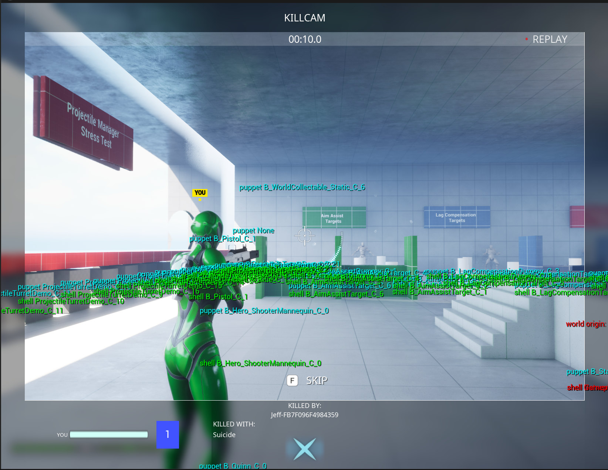

# Debugging

When a replay looks wrong, the question is almost always "what did the replay decide, and why". Visual Replay answers it with a **debug suite** that records facts at every decision point: what was recorded or skipped, what each shell did, what was hidden from the viewer, which events played. This page covers turning the suite on, reading what it collects, troubleshooting common symptoms, and the full settings reference.

The whole suite is compiled out of Shipping builds.

***

## Turning It On

Facts are grouped into categories, and nothing is collected until a category is on.

| Category | Holds |
| --- | --- |
| `Recorded` | What the recorder was offered, and what it recorded or skipped and why |
| `Window` | What a replay's window holds, and what a perspective clip replaced |
| `Network` | Clips and tracks travelling between machines, and how replicated actors arrived |
| `StoodIn` | The puppets and shells standing in for recorded actors |
| `Played` | Events played back and everything they spawned |
| `Presented` | What the viewer is shown and what is hidden from them |
| `Game` | Facts a game adds about its own use of replays |
| `Stats` | Timings, sizes and counts |

`Replay.Debug all` turns everything on and `Replay.Debug off` turns it off. Categories can also be listed by name, such as `Replay.Debug StoodIn,Presented`. `Replay.Debug` on its own prints which categories are on. The `-ReplayDebug=` command line option does the same from startup.


Turn the categories on **before** the moment you want to understand happens. Many facts are recorded when something is recorded, such as a mesh being skipped, not when the replay plays.


Every fact is also written to the log under `LogVisualReplayDebug`, one line each, with the machine it came from, such as `Server`, `ListenServer` or `Client1`, so facts from several PIE instances can be told apart.

***

## The Report

When a session starts with any category on, the suite writes a report to `Saved/Logs/VisualReplay`, named after the time and the machine, and updates it when the session stops. `Replay.Report` writes one on demand. A report has five parts:

1. **Anomalies**: facts that point at something wrong. If this says `none`, the replay did what it meant to.
2. **Replay as a whole**: facts about the window and the session.
3. **Stories**: every fact about each subject the replay touched, in order, including what was recorded about it before the window.
4. **Statistics during this replay**.
5. **Statistics since the debug suite started**.

Here is an excerpt from a real kill cam on a listen server, cut down:

```
Visual replay report Replay_2026.10.07-13.31.05_ListenServer
world=L_ShooterBaseDemo netmode=listen server machine=ListenServer written=100.666 categories=0xff
window=80.200..91.200 now=89.381

Anomalies
  none

Replay as a whole
  [Replay] t=88.200 machine=ListenServer category=Network what=KillerTrackReceived subject=none class=none track=aim samples=634
  [Replay] t=91.235 machine=ListenServer category=Window what=WindowOpened subject=none class=none start=80.200 end=91.200 tracks=67 state_objects=222 events=60 ...
  [Replay] t=91.235 machine=ListenServer category=Window what=PreparationStarted subject=none class=none budget_ms=4.00
  ...

Stories
== B_Hero_ShooterMannequin_C_4 (B_Hero_ShooterMannequin_C)
  [Replay] t=98.409 machine=ListenServer category=Played what=SoundCreated subject=B_Hero_ShooterMannequin_C_4 ... sound=MSS_Weapons_Rifle2_Fire class=SC_Killcam playing=1
  ...

Statistics during this replay
  Playback.FrameMs last=0.7204 avg=0.8175 min=0.5712 max=3.7061 samples=386
  Recorder.VisualFrameMs last=0.1126 avg=0.0993 min=0.0497 max=1.0765 samples=386
```

Subjects keep their name and class after they are destroyed, so a story still reads correctly for an actor that died halfway through the window. Facts about destroyed objects are kept for `Replay.Debug.RetentionSeconds` (60).

`Replay.Explain <name>` prints the same story for every subject whose name or class contains the text, straight to the console, which is the quickest way to ask "what happened to this actor".

***

## Anomalies

| Anomaly | Means | First thing to check |
| --- | --- | --- |
| `ShellWithoutPuppet` | A shell has no puppet, because none of its actor's meshes were recorded, so nothing places it | Whether the actor's meshes are Movable; `MeshSkipped` facts in its story give the reason |
| `ShellSpawnFailed` | A shell of a recorded class could not be spawned | Whether the class can be spawned at all, or should be excluded |
| `ValueNotImported` | A recorded value could not be applied to its shell | The property named; a type that doesn't round-trip as text is usually best excluded |
| `EventWithoutStandIn` | An event's subject had no stand-in, so the event couldn't play | Whether the subject was recorded, or excluded |
| `LiveReferenceKept` | After remapping an event's payload, it still pointed at a live replicated actor that had no stand-in | The property named; the event player may need to handle that reference |
| `AttachedEffectHasNoPuppet` | An effect on a moving part couldn't play, because the part had no mirror and its actor no puppet | Whether the part it was attached to is recorded |
| `DecalHasNoMirror`, `LightHasNoMirror` | The same for a decal or a light | As above |
| `EffectNearOrigin` | An effect started near the world origin | An effect that lost what it was attached to |
| `HistoryCleared` | The recording clock stepped back by more than a window, so history was cleared | What the game set as the recorder's clock |

Kill cam anomalies are listed on the kill cam's own [Debugging](../shooter-base/kill-cam/debugging.md) page.

***

## Troubleshooting by Symptom

| Symptom | Likely cause | Where to look |
| --- | --- | --- |
| An actor is missing from the replay, or stuck at the world origin | Its meshes weren't recorded, so it has no puppet | `ShellWithoutPuppet` and `MeshSkipped`; [Recording](recording.md) |
| An actor appears in its starting state instead of its recorded one | BeginPlay applies a setting on every machine | [Decide on the server, show on clients](replay-friendly-gameplay-code.md#decide-on-the-server-show-on-clients) |
| A marker or effect that appears after a wait never shows | A timer, which never fires on a shell | [Wait with Delay, not timers](replay-friendly-gameplay-code.md#wait-with-delay-not-timers) |
| Something shows twice | A live object wasn't hidden, or both a shell and the playback drew it | `LiveHidden` facts in its story; who draws an actor's cosmetics, in [Events and Cosmetics](events-and-cosmetics.md) |
| The HUD shows live values | UI reading a cached live object | [UI for a replayed player reads its stand-in](replay-friendly-gameplay-code.md#ui-for-a-replayed-player-reads-its-stand-in) |
| A shell's inventory, equipment or tags are empty | A fast array not registered, or state excluded | The warning naming the fast array type; [Recording](recording.md) |
| The log warns that a class logs errors as its stand-in comes up | The class registers with live systems as it begins play | Exclude it with `AddGloballyExcludedClass`, or make it replay-aware |
| An effect restarts when the window opens | A Cascade effect, which can't be simulated forward | `EffectShownPartway` facts; Niagara effects catch up |
| The replay stalls or slows | It is waiting for more of a perspective clip | `BufferingStarted` and `BufferingEnded` facts; [Sessions](sessions.md) |

***

## Seeing It in the Viewport

`Replay.Debug.Draw 1` draws problems in the world while a replay runs: shells without a puppet in red, and the world origin when something is stranded there. `Replay.Debug.Draw 2` also labels every puppet and shell, with a line from each shell to the puppet it follows.

<figure><figcaption><p>Replay.Debug.Draw 2 during a kill cam, with every puppet and shell labelled and the world origin marked in red</p></figcaption></figure>

***

## Other Commands

| Command | Does |
| --- | --- |
| `Replay.Test <seconds> <speed>` | Replays the last few seconds to the first local player. Needs something recording, such as an experience with the kill cam; if nothing is, it starts recording and asks you to run it again. |
| `Replay.Stop` | Stops a `Replay.Test` replay |
| `Replay.Stat` | Prints what the recorder holds and what it costs, with the debug statistics |
| `Replay.DumpTrack <filter>` | Prints the recorded look tracks whose names match |
| `Replay.DumpState <filter>` | Prints the recorded state of objects whose names match |
| `Replay.Explain <name>` | Prints every fact about matching subjects |
| `Replay.Report` | Writes a report now |

***

## Adding a Game's Own Facts

A game adds facts about its own use of replays to the same reports, in the `Game` category, through the same macros the plugin uses.

<details>

<summary>In code: the debug macros</summary>

`VISUALREPLAY_DEBUG_FACT(Context, Category, What, Subject, Format, ...)` records a fact; the detail is a printf format, only evaluated when the category is on. `VISUALREPLAY_DEBUG_FACT_ONCE` keeps a fact that would repeat every frame only once, `VISUALREPLAY_DEBUG_ANOMALY` records one that points at something wrong, and `VISUALREPLAY_DEBUG_STAT(Context, Name, Value)` adds a statistics sample. The subject is an `FVisualReplayDebugSubject`, built from any object. All of them compile to nothing when the suite is compiled out.

</details>

***

## Settings Reference

| Setting | Default | Controls |
| --- | --- | --- |
| `Replay.Enabled` | on | Recording frames, events and cosmetics at all |
| `Replay.WindowSeconds` | 10 | How much history is kept |
| `Replay.StateSampleRateHz` | 30 | How often replicated state is sampled |
| `Replay.MaterialSampleRateHz` | 30 | How often materials are checked for changes |
| `Replay.RescanIntervalSeconds` | 0.5 | How often tracked actors are rescanned for new meshes |
| `Replay.ExactPoses` | off | Full-precision poses, for about four times the memory |
| `Replay.LeadInSeconds` | 20 | How much longer events are kept, for the lead-in |
| `Replay.LeadInTickSeconds` | 0.05 | The step effects are simulated in between lead-in events |
| `Replay.EffectCatchUpSeconds` | 5 | The most an effect shown partway through is simulated forward |
| `Replay.EasedLeadSeconds` | 1 | How close to the end of what has arrived playback starts to slow |
| `Replay.EasedMinSpeed` | 0.85 | The slowest playback eases to, as a fraction of normal speed |
| `Replay.Debug.Draw` | 0 | Drawing problems and labels in the viewport |
| `Replay.Debug.RetentionSeconds` | 60 | How long facts about destroyed objects are kept |

***

## The Tests

The plugin's tests in `Plugins/VisualReplay/Source/VisualReplayTests` describe what the system guarantees, one behaviour each. They are grouped by area: `Recording`, `State`, `Session`, `PerspectiveClip`, `Effects`, `Cosmetics`, `Seek`, `Debug`, `Playback`, `Decals`, `Lights`, `Codec`, `Robustness` and `Sandbox`. Run them all with the automation filter `VisualReplay`.

`Benchmark.Replay.FrameCost` builds a busy scene of animated characters, replicated actors and moving props, records it, encodes it, replays it, and logs what each step costs. It checks nothing; it is for measuring a change.
