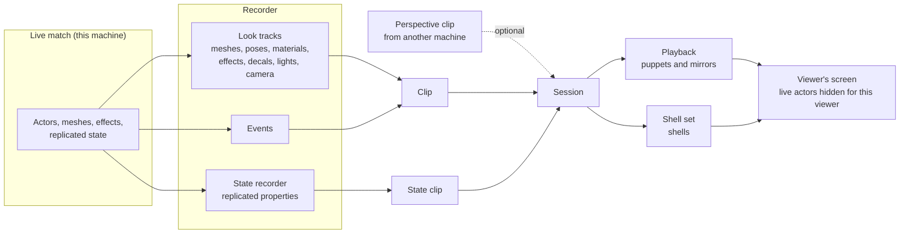

# How It Works

Visual Replay has three moving parts. A **recorder** keeps the last few seconds of the match on this machine. A **session** plays a window of that history back inside the live world, for one viewer. Two **layers** do the playing: puppets draw what was seen, and shells behave the way the recorded actors did. This page gives the overall picture, the vocabulary every other page in this section uses, and the order things happen in on each update.

***

## The Big Picture



Recording is continuous but only runs while something has asked for it. Every machine that records keeps its own history: what *it* drew and what *it* received. When a replay starts, the session cuts a window out of that history, as a **clip** of the look and a **state clip** of the replicated values. It then brings both back to life next to the live match.

Normally a replay shows this machine's own recording. When another machine saw something better, such as a killer's own view of a kill, its recording can arrive as a **perspective clip**. That clip replaces this machine's recording of the actors it covers. [Perspective Clips](perspective-clips.md) covers how.

***

## Two Layers, Two Recordings

A replay needs to look exactly like the moment did, and it needs the moment's game state to behave. No single copy does both.

* **A mesh copy alone looks right but knows nothing.** It can't show an objective marker, colour a character by team, attach a muzzle flash to a weapon socket, or feed a HUD that reads ammo from a weapon.
* **A copy of the actor alone behaves right but looks wrong.** Replicated state is coarse: positions arrive at network rate, and animation runs locally on each machine. An actor rebuilt only from replicated values would animate differently from what was on screen.

So Visual Replay records twice and plays back in two layers.

| Layer | Built from | Does |
| --- | --- | --- |
| **Puppets** | The look tracks: transforms, finished poses, materials and visibility of every recorded mesh | Draw what was drawn, frame for frame. Inert: no logic, no collision, no replication. |
| **Shells** | The state recorder: the replicated properties of every replicated actor | Run the actor's own class and logic from the recorded values: rep notifies, BeginPlay, its markers and the effects it attaches. Draw no meshes when a puppet draws them. |

The layers are tied together. A shell **follows** its actor's puppet: it stands where the puppet stands, and its hidden meshes take the puppet's pose, so anything the shell attaches to a socket appears exactly where the puppet draws it. [Puppets and Shells](puppets-and-shells.md) covers both layers in depth.

***

## Vocabulary

These terms mean the same thing on every page in this section.

| Term | Meaning |
| --- | --- |
| **Recording clock** | The time every sample is stamped with. A game can set it to server time so recordings made on different machines line up. |
| **Window** | The stretch of recorded time a replay plays, from a start time to an end time on the recording clock. |
| **Clip** | The look of a window: mesh tracks, the cosmetic tracks of effects, decals and lights, camera samples and events. Self-contained, so it stays valid while recording carries on. |
| **State clip** | The recorded replicated values of a window, enough to bring every recorded actor up as it was at the window's start and move it through the window. |
| **Perspective clip** | A clip recorded on another machine for chosen actors, called its **subjects**, sent to this machine to play instead of this machine's own recording of them. |
| **Puppet** | One per recorded actor that had a recorded mesh. Holds the mirrors that draw it. |
| **Mirror** | The replay's copy of one recorded component: a mesh, an effect, a decal or a light. |
| **Pose driver** | A hidden component holding the replayed pose of a skeletal mesh. The visible skeletal mirror follows it, so anything asking the puppet for a bone or socket finds the recorded pose. |
| **Shell** | A real copy of a recorded replicated actor, of its own class, brought up the way a client receives an actor and run from the recorded values. |
| **Stand-in** | Whatever represents a recorded object in the replay: a shell, an object inside a shell, or a puppet. Events and recorded references are pointed at stand-ins. |
| **Lead-in** | Events from just before the window that still showed something as it opened, repeated while the replay prepares, so effects that were already playing are on screen from the first frame. |
| **Sandbox scope** | Marks code running for the replay. Inside it nothing is recorded, actors spawned stay local, and game systems can tell they are dealing with replay code. |

***

## One Update

The live world keeps ticking while a replay plays. Once per frame the session moves replay time forward and applies it in a fixed order. Most of the behaviour described on later pages follows from this order.

```
each update, at replay time t:
    let go of live effects that finished       // their pool may hand them to the replay next
    shells:   apply the recorded state at t    // first, so an actor appearing now has its shell before its events play
    puppets:  place mirrors at t               // transforms, poses, materials; effect, decal and light copies follow
    shells:   follow their puppets             // the shell and its hidden meshes move to where the puppet draws them
    events:   fire everything recorded up to t // last, so what an event spawns at a shell or a socket appears where it is drawn now
    game hook: OnTimeApplied                   // for example giving a stand-in player its recorded view rotation
```

Two consequences are worth knowing before reading further.

* **Events always find their stand-in.** A shell is retired one update *after* its actor ended. A projectile's impact recorded at the moment the projectile was destroyed still plays on the projectile's shell.
* **Spawned things land in the right place.** An event that spawns an effect at a weapon's muzzle socket runs after the weapon's shell mesh has been posed where the puppet draws it, not where it stood a frame ago.

<details>

<summary>In code: the update order</summary>

The order lives in `UVisualReplaySession::ApplyTime`. `UVisualReplayShellSet::SetTime` and `UVisualReplayPlayback::PlaceAt` do the two layers' work, and `UVisualReplayPlayback::FireEventsUpTo` plays the events. `Tick` decides what time to apply: it also handles pause, speed, and waiting for more of a perspective clip, which [Sessions](sessions.md) covers.

</details>

***

## A Replay Is Local to One Viewer

A replay happens on one machine, for one `PlayerController`, and nothing about it replicates.

* Puppets and shells exist only on this machine. Actors spawned inside the sandbox scope are made non-replicating before they finish spawning, which matters on a listen server, where the host's replay runs inside the authoritative world.
* The live actors the replay stands in for are hidden from **that viewer only**, through the player controller's own hidden lists. Other players, and on a listen server every connected client, keep seeing the live match.
* Live audio is the exception: ducking it uses one sound mix for the whole game. [Sessions](sessions.md) lists exactly what is hidden and muted.

This is what lets a victim watch a kill cam while the match continues around them, and lets a listen server host watch one without affecting anyone else.

***

## Where Things Live in the Code

The runtime module is about 14.5k lines. These groups map the concepts above to files, all under `Plugins/VisualReplay/Source/VisualReplayRuntime`.

| Concept | Files | Size |
| --- | --- | --- |
| Recorder: requests, registration, per-frame recording, extracting clips | `VisualReplaySubsystem` with its `_Registration`, `_Recording` and `_Clips` parts | \~2.5k |
| State recording | `VisualReplayStateRecorder`, `VisualReplayStateTypes` | \~1.1k |
| Shared data model: tracks, samples, clips, joining parts | `VisualReplayTypes`, `VisualReplayShared` | \~1k |
| Playback: puppets, mirrors, cosmetics, events | `VisualReplayPlayback` with its `_Events` and `_Cosmetics` parts | \~2.6k |
| Shells | `VisualReplayShellSet` | \~1.9k |
| Session: preparing, updating, hiding the live world, seeking | `VisualReplaySession` | \~1.5k |
| Sandbox scope and cosmetic capture | `VisualReplaySandbox`, `VisualReplayCosmetics` | \~0.3k |
| Fast array support for shells | `VisualReplayFastArrays` | \~0.3k |
| Codec for perspective clips | `VisualReplayClipCodec` with its private, `_Encode` and `_Decode` parts | \~2.3k |
| Debug suite | `VisualReplayDebug` | \~1.2k |

The tests in `Plugins/VisualReplay/Source/VisualReplayTests` are the most precise statement of what the system promises. Each test is named for a behaviour, such as `VisualReplay.Session.ShellsFollowTheirPuppets` or `VisualReplay.Seek.BackPastAShellsEndBringsItBack`, and its comment states the behaviour in a sentence. When it isn't clear whether something is intended, the test list is the place to check. [Debugging](debugging.md) has the full catalogue.

<details>

<summary>A reading order for the code</summary>

The spine of a replay is the session. Follow `UVisualReplaySession::Start` into `PrepareUntil` (puppets, shells, the lead-in and the shells of later actors, a little at a time), then `FinishStart` (puppets and the lead-in shown, live actors hidden), then `Tick` and `ApplyTime` for every frame after. `Stop` hands what the replay made to `UVisualReplayDisposal`, which removes it over the frames that follow.

From `ApplyTime`, branch into `UVisualReplayShellSet::SetTime` for the shells and `UVisualReplayPlayback::PlaceAt` for the puppets. For the recording side, start at `UVisualReplaySubsystem::RegisterActor` and `RecordFrame`.

</details>
