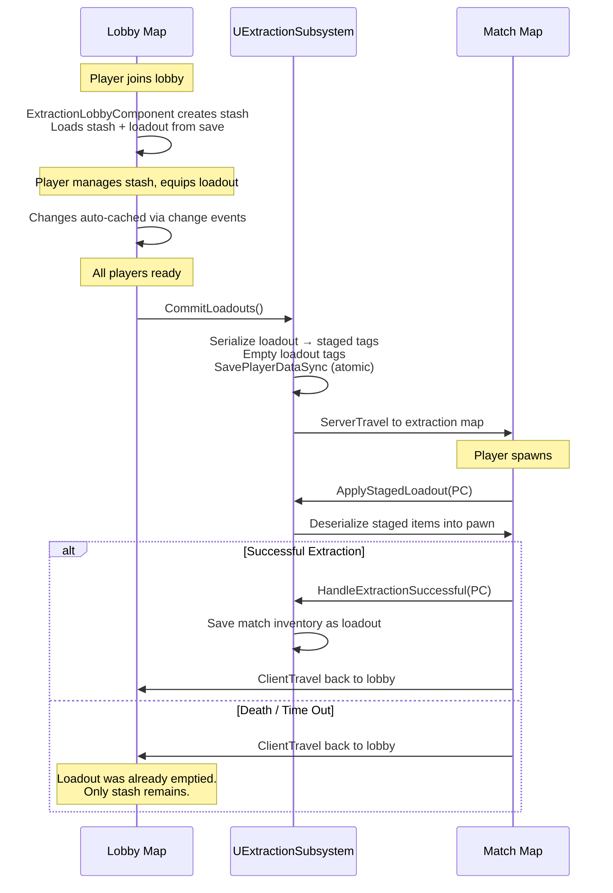

# Extraction

**Plugin:** `Plugins/GameFeatures/Extraction/`\
**Dependencies:** ShooterBase, TetrisInventory, GameplayMaps

A high-stakes loot-and-extract mode where players collect items and must reach extraction points to keep their loot.

***

### Content Structure

```
Content/
├── Accolades/
├── Bot/
├── Experiences/
│   ├── Lobby/
│   └── Solo/
│       └── Phases/
├── Game/
│   ├── Death/
│   ├── Extraction/
│   └── ItemSpawning/
├── GameplayCues/
├── Hero/
├── Items/
├── Maps/
├── System/
│   └── Playlists/
└── UserInterface/
```

***

### Notable Systems

* **Extraction Points** — Dedicated extraction zone logic in `Game/Extraction/`
* **Item Spawning** — Loot distribution system in `Game/ItemSpawning/`
* **Items** — Mode-specific item definitions
* **Experience Phases** — Multi-phase flow with solo variant
* **Death Handling** — Custom death behavior for the extraction format
* **Stash & Loadout Persistence** — Players keep extracted loot across sessions via the [Save System](../../base-lyra-modified/save-system/)

#### Players can be looted after death

* Allowing the character mesh to be overlap with the interaction trace when dead, this means interactions are only possible when dead
* Override the death start functions, so the player ragdolls and the equipment of the player isn't hidden. This also handles setting up the looting inventory.
* Give the dead player an Tetris Inventory Component at the time of death, and a sphere collision so that players can get read only access when near by (full access is provided by opening the dead player inventory in the `GA_Interaction_OpenTetrisInventory` ability.
* Setup the interaction options to make the player open an inventory
* The `Extraction_Hero`, has a custom death ability, this is not a child of the default Lyra Death ability that comes with Lyra. This is so that `death_finish` isn't called when the ability ends. In extraction there is no concept of finish dying because once a player dies they leave the game mode, and as for the dead pawn, we don't want it to get destroyed since it might be looted.

***

### C++ Classes

The extraction plugin includes three C++ classes that orchestrate the stash, loadout, and match flow:

| Class                       | Type                     | Role                                                                                                                                                        |
| --------------------------- | ------------------------ | ----------------------------------------------------------------------------------------------------------------------------------------------------------- |
| `UExtractionSubsystem`      | `UGameInstanceSubsystem` | Save orchestration: commits loadouts before match travel, applies staged items on spawn, saves loot on successful extraction. Handles map travel            |
| `UExtractionLobbyComponent` | `UGameStateComponent`    | Per-player stash management: creates/destroys stash inventories on player login/logout, loads and saves loadouts, manages the ready-up system               |
| `UExtractionStashComponent` | `UActorComponent`        | Stash access point: placed on world actors (NPCs, terminals). Resolves the player's stash from the lobby component and auto-saves when the UI window closes |

These classes use the generic [Save System](../../base-lyra-modified/save-system/) for all persistence, they don't implement their own serialization.

***

### Match Flow



***

### Save Tags

The extraction mode organizes save data using six gameplay tags:

| Tag                               | Contents                                      | Lifecycle                                      |
| --------------------------------- | --------------------------------------------- | ---------------------------------------------- |
| `Save.ExtractionStashInventory`   | Player's stash inventory (persistent storage) | Persists across all sessions                   |
| `Save.ExtractionStashEquipment`   | Player's stash equipment                      | Persists across all sessions                   |
| `Save.ExtractionLoadoutInventory` | Items the player is bringing into a match     | Populated in lobby, emptied on commit          |
| `Save.ExtractionLoadoutEquipment` | Equipment the player is bringing into a match | Populated in lobby, emptied on commit          |
| `Save.ExtractionStagedInventory`  | Committed loadout inventory (in-transit)      | Written before travel, consumed on match spawn |
| `Save.ExtractionStagedEquipment`  | Committed loadout equipment (in-transit)      | Written before travel, consumed on match spawn |


### Dedicated server testing requires a real online subsystem.

On a dedicated server, player saves are keyed by platform ID (`PlayerState->GetUniqueId()`). In PIE without Steam, EOS, or another online subsystem configured, this ID changes every session, so stash and loadout data won't persist between PIE sessions when testing as a client. Use standalone networking mode for persistence testing, or configure an online subsystem for dedicated server testing.



### PIE client mode generates orphaned save files.

Because the platform ID changes each PIE session, every run in dedicated server client mode creates a new save file in `Saved/SaveGames/` with a unique alphanumeric suffix (e.g., `PlayerSaveGame_Jeff-0C9B411E4C430A560F19EE98E09267E0.sav`). These files accumulate and are never reused. The base `PlayerSaveGame.sav` from standalone mode is fine to keep, only delete the ones with platform ID suffixes.



### Production note:

The default implementation saves to the server's local disk, which is sufficient for development and single-server deployments. For a scalable production game with multiple server instances, player data should be persisted to a database via a backend service instead. See [Replacing the Storage Backend](../../base-lyra-modified/save-system/extending-the-save-system.md#replacing-the-storage-backend) for guidance on swapping the storage layer.


The staged tags exist to survive map travel. `CommitLoadouts` writes the loadout to staged tags and empties the loadout tags atomically with a synchronous save. If the player crashes mid-match, the save on disk has the stash intact and an empty loadout, the staged items are lost, which is the intended behavior (death = loss).

