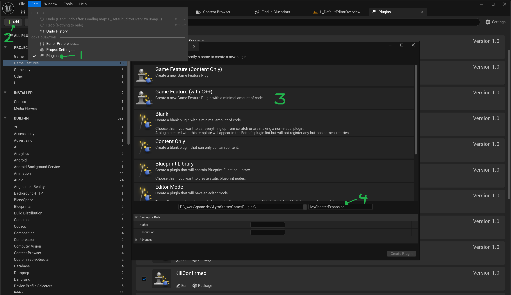

# Installing & Setup

This section ensures users understand how to properly install and set up the framework, emphasizing **best practices for customization and updates**.


Unlike standard Unreal Engine plugins, this framework is designed as a **standalone project**, similar to Lyra. **It is not meant to be added to an existing project.** Instead, developers should start their game development within this framework and modify it to suit their needs.


### **Downloading the Project**

You can obtain the framework via the **Unreal Engine Marketplace** (once released).


This project would require at least **Unreal Engine 5.5**


### **Opening the Project**

1. Open **Unreal Engine 5** (latest stable version recommended).
2. Click **"Open Project"** and navigate to the downloaded project folder.
3. Select the **`.uproject`** file and open it.
4. (If prompted) Convert the project to the latest engine version.

### **Getting Started**

Once the project is open, you can immediately **playtest existing game modes**, inspect the included assets, and begin modifying the project to fit your game.


To make **future updates easier**, it’s strongly recommended that you avoid modifying the core framework directly. Instead, follow the **best practices** below.&#x20;


### **Best Practices for Working With This Framework**

**The best way to add custom content is by creating a Game Feature Plugin for your own core modules and game modes rather than modifying the base project.**

🔹 **Why?**

* Ensures **seamless future updates** without breaking core functionality.
* Keeps your custom content **modular and independent**.
* Maintains compatibility with the **Lyra architecture** and Unreal's Modular Gameplay System.

#### How To Create a Game Feature Plugin

1. In **Unreal Engine**, go to `Edit → Plugins`
2. Click `Add`
3. Select `Game Feature Plugin` and choose **C++** (even if you don’t use C++ initially, this keeps the option open for later).
4. Name it something relevant to your game (e.g., "MyShooterExpansion")
5. Setup dependant game features based on the features you want. (You would typically want, GameplayAbilities, ModularGameplay, GameplayMessageRouter, AsyncMixin, CommonUI, CommonGame, EnhancedInput, LyraExampleContent, then you can add the relevant core modules).
6. Create a Lyra Experience set it to the map in that plugin (this will make sure the experience runs when playing from that map)

<figure><figcaption></figcaption></figure>


If you don't like images and want a video (I don't blame you), this is a [good guide](https://www.youtube.com/watch?v=AaGxHtQ0okw). One thing to keep in mind is that is based on Lyra, not my plugin (will make a video later if necessary), so the plugin dependencies used in the video are not in this project, like ShooterCore.


### Project Structure

In the editor, the modified lyra code is inside the content folder, the game feature plugins are inside the plugin folder. If you want to add or modify c++ code of game features you can find them in `/Plugins/GameFeatures/ProjectName` .


If you can't see any plugins, make sure you tick "Show Plugin Content", in the settings of your content browser.

