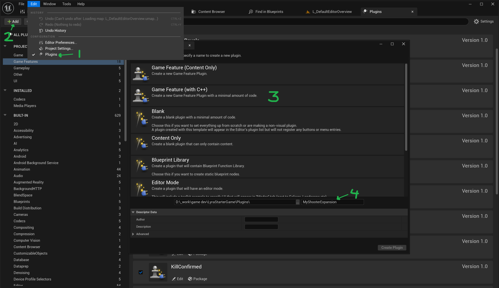

# Installing & Setup

This section ensures users understand how to properly install and set up the framework, emphasizing **best practices for customization and updates**.


Unlike standard Unreal Engine plugins, this framework is designed as a **standalone project**, similar to Lyra. **It is not meant to be added to an existing project.** Instead, developers should start their game development within this framework and modify it to suit their needs.


***

### **Downloading the Project**

You can obtain the framework via the **Unreal Engine Marketplace** (once released).


This project would require at least **Unreal Engine 5.6**


***

### **Opening the Project**

* Open Unreal Engine 5 (latest stable version recommended)
* Select Open Project
* Navigate to the downloaded folder and select the .uproject file
* If prompted, convert the project to the latest engine version
* Let Unreal compile and open the editor


The first load may take a few minutes due to shader compilation and plugin initialization.


***

### **Understanding the Project Structure**

Before diving in, a quick look at where things are:

* `📂 Content/`
  * Contains core assets and any modified Lyra framework code. **Generally, avoid modifying these directly to ensure easier updates.**
* `📂 Plugins/`
  * This is a standard Unreal Engine plugins directory.
* `📂 Plugins/GameFeatures/`
  * **This is the primary location for modular content.** Each subdirectory here is a separate **Game Feature Plugin**.
  * **Core Framework Plugins:** You'll find the foundational plugins of this asset here (e.g., `ShooterBase/`, `TetrisInventory/`, `GameplayMaps/`, `TrueFirstPerson/`).
  * **Example Game Mode Plugins:** The pre-built game modes (e.g., `TeamDeathmatch/`, `Arena/`, `BattleRoyale/`) also reside here as individual Game Feature Plugins.
  * **Your Custom Plugins:** When you create new game modes or features, they will also become subdirectories in `Plugins/GameFeatures/`.

**Core Philosophy:** This framework is built on modularity using **Game Feature Plugins** and **Experiences**.

* **Game Feature Plugins:** Package distinct gameplay systems (core mechanics or specific game modes). Their dependencies on other plugins are defined in their respective `.uplugin` files.
* **Experiences (`ULyraExperienceDefinition`):** Data Assets (usually found within a Game Feature Plugin's `Content` folder) that define _what_ game mode to run, _which_ Game Features to activate for that session, default player setups, and UI.


#### Making It Yours

This is your project, feel free to modify anything. There’s just one practical tradeoff to be aware of:

**Editing core plugins** (like ShooterBase, TetrisInventory, etc.) means that when a framework update is released, you’ll need to merge those updates with your changes using Git. This is completely normal and manageable with version control, but it is extra work.

**Creating new Game Feature Plugins** for your content is the easiest path, it keeps your work separate from core systems, so updates apply cleanly with no merge work on your end.

**The Easy Path: New Game Feature Plugins**

* **New game modes, major features, or big changes** → Create a new Game Feature Plugin. Your work stays independent of core systems.
* **Tweaking an example game mode** → Create a new Game Feature Plugin, copy the relevant assets (Experience Definition, Pawn Data, Action Sets) from the example, and modify the copies. The originals stay intact for reference.

**Editing Core Systems**

If a new Game Feature Plugin won’t cut it, maybe you need to change how a core system fundamentally works, go ahead and edit it directly. Just keep in mind:

* Use Git to track your changes so you can merge future updates
* The more targeted your edits, the easier merges will be
* Core plugins are designed with extension points (subclassing, configuration, delegates), so check if those can solve your problem first, not because editing is wrong, but because it may be less work for you


***

### How To Create a Game Feature Plugin

1. In **Unreal Engine**, go to `Edit → Plugins`
2. Click `Add`
3. Choose **Game Feature Plugin**
4. Select **C++** as the base (even if you won’t use C++ yet, it allows expansion later)
5. Name your plugin (e.g., `MyShooterExpansion`)
6. Add necessary dependencies (see below)


In the editor, the modified lyra code is inside the content folder, the game feature plugins (including the ones you create) are inside the plugin folder. If you want to add or modify c++ code of game features you can find them in `/Plugins/GameFeatures/ProjectName` .\
\
If you can't see any plugins in the editor, make sure you tick "Show Plugin Content", in the settings of your content browser.


#### Common Plugin Dependencies:

* `GameplayAbilities`
* `ModularGameplay`
* `GameplayMessageRouter`
* `AsyncMixin`
* `CommonUI`, `CommonGame`
* `EnhancedInput`
* `LyraExampleContent`
* Relevant core features like `ShooterBase`, `TetrisInventory`, etc.


You can manage these dependencies manually in the `.uplugin` file or via the Game Feature Data Asset.


<figure><figcaption></figcaption></figure>


If you don't like images and want a video (I don't blame you), this is a [good guide](https://www.youtube.com/watch?v=AaGxHtQ0okw). One thing to keep in mind is that the video is based on Lyra, not my plugin, so the plugin dependencies used in the video are not in this project, like `ShooterCore`.


***

### Important Note About Activation

After creating your plugin, **you won’t see any gameplay changes right away.** That’s expected.

To make your plugin do anything, you must:

* Create an **Experience Definition**
* Assign it to a map or load it dynamically

These concepts are explained fully in the next page, [Quick Start Guide](quick-start-guide.md),  and the [Game Framework & Experiences](../base-lyra-modified/gameframework-and-experience/) section.

Or you can check [Lyra's guide](https://dev.epicgames.com/community/learning/tutorials/rdW2/unreal-engine-how-to-create-a-new-game-feature-plugin-and-experience-in-lyra) if you prefer a quick step by step guide

***

Now that your project is set up and your workspace is ready, let’s launch a game mode and explore how Experiences and modular features come together.
