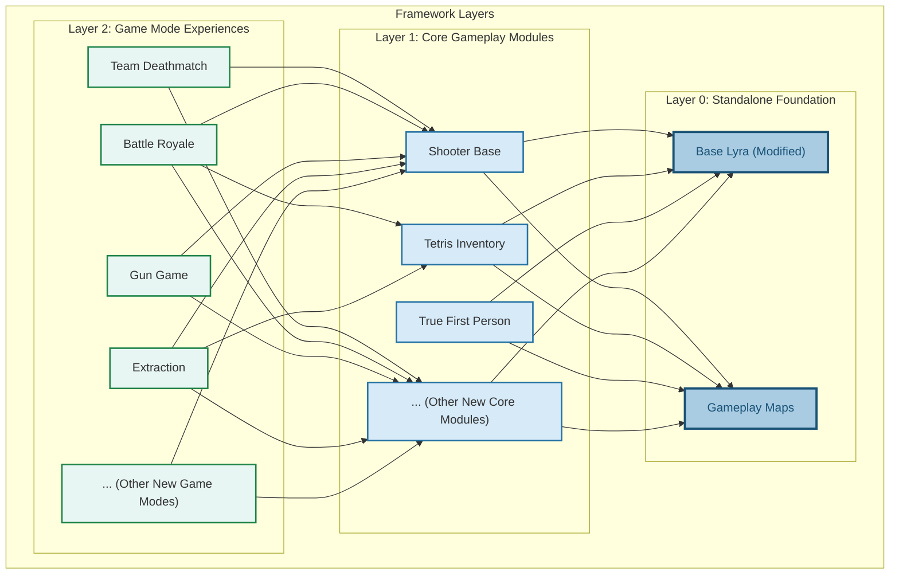

# Project Architecture

### **Overview of the Design Philosophy**

Before diving into the individual features, it's important to **understand how this framework is structured** and why it was designed this way.

This framework is built on **Lyra’s Game Features, Modular Gameplay, and Experience System**, allowing you to **mix and match features dynamically** rather than being locked into a rigid workflow.

By embracing a **composition-based design**, this system enables developers to build highly modular and scalable multiplayer shooters while balancing **performance (C++) and flexibility (Blueprints).**

This section provides a **high-level overview**—subsequent sections will **dive deeper into each system** so you can see how everything fits together.

#### **Key Principles**

* **Composition over inheritance** – Features are built as modular components rather than deep inheritance chains.
* **Opt-in systems** – Just about anything (player abilities, pawn components, UI, game mechanics, etc) can be selectively enabled or disabled, thanks to Lyra's experience systems.
* **Blueprint-friendly but C++-powered** – Core logic is in C++ for performance with blueprint-exposed functions, while Blueprints handle UI and gameplay tweaks.
* **Network-optimized** – Designed with multiplayer performance in mind (e.g., lag compensation, lightweight projectiles, replication optimizations).


**Hint:** If you're new to the concept of composition in game development, check out the video [_"Composition Over Inheritance"_](https://www.youtube.com/watch?v=HNzP1aLAffM). It provides a clear explanation of how this approach applies to Object-Oriented Programming in games.


***

### **C++ vs Blueprint Breakdown**

This framework takes a **hybrid approach**, using C++ for performance-critical systems while keeping Blueprints accessible for designers.

* **Performance-heavy features** (e.g., projectiles, networking, ability system) are in **C++**.
* **Designer-driven elements** (e.g., UI, customization options) remain in **Blueprints**.
* **Key functions are exposed** in Blueprints for easy modifications without touching C++.

***

### **Dependency Structure**

This framework is **layered**, meaning each level **depends only on the layers below it**.

* **Base Lyra is standalone** – It has been modified, but it doesn’t require additional modules.
* **Gameplay Maps is standalone** – It contains the reusable maps used by different game modes.
* **Core Modules rely on Base Lyra** – They add mechanics like shooting, inventory, and true first-person controls.
* **Game Modes rely on Core Modules and Base Lyra** – They determine the rules and gameplay experience and are completely isolated.


Core Modules depend on the Gameplay Maps only to showcase their functionality through demo levels. If you remove these demo levels from the Core Modules, the dependency on Gameplay Maps is removed entirely.







**Note:** These is just an example of the structure and **doesn't not indicate the actual dependency** for each game mode. When creating new **Game Modes** or **Core Gameplay Modules**, you determine the dependencies between different game features




```
[Base Lyra, Gameplay Maps]  <- Independent, standalone  
  ├── [Shooter Base]  
  ├── [Tetris Inventory]  
  ├── [True First Person]
  ├── ... [New Core Modules]  
       ├── [Team Deathmatch]  
       ├── [Battle Royale]  
       ├── [Gun Game]  
       ├── [Extraction]  
       ├── ... [New Game Modes]
```


This shows a better understanding of the dependencies layers




#### **What This Means in Practice**

* **You can delete any game mode** (TDM, BR, Extraction) without breaking anything.
* **You can remove entire features** (e.g., the Inventory System) without affecting other systems. (**Note:** this would require **deleting** game modes depending on that core feature)
* **Game modes dynamically load only what they need** – No hardcoded dependencies

***

### **Modular & Extensible Design**

This framework is **built on a** [**modular gameplay approach**](../base-lyra-modified/gameframework-and-experience/game-features/), meaning **everything is opt-in**—you only include what you need.

#### **How This Works**

Each major system is designed as a **Game Feature Plugin**, meaning:&#x20;

* Game modes can selectively **enable or disable** specific features.
* New mechanics can be added **without modifying core classes**.
* Plugins can be updated independently **without breaking the entire project**.

#### **Examples of Modularity**

* The **Inventory System** doesn’t dictate the UI—you can build your own visual layer.
* The **Weapon System** allows new mechanics without modifying base weapon classes.
* The **Spawning System** dynamically adjusts based on **game mode conditions** (e.g., BR vs. TDM).

***

### **Experience System: The Core of Modularity**

The **Experience System** is the backbone of how game modes are defined and modular content is loaded in this framework. It determines what features, UI, inputs, abilities, and logic are activated for each gameplay session.


This is a high-level summary for context. For a deep dive into how Experiences and Game Features work, including key data assets and interaction flow, [see the full Game Framework & Experiences documentation.](../base-lyra-modified/gameframework-and-experience/)


#### **What It Controls**

* **What abilities a character has**
* **What UI elements are enabled**
* **What components are spawned**
* **What inputs are enabled and their bindings**
* **Which plugins are active per game mode**

#### **Example Use Cases**

**Battle Royale & Extraction & TDM Inventory**

* BR: Players spawn with a grid inventory (similar to Apex legends) that they can interact with
* Extraction: Players spawn with a **full jigsaw inventory** (similar to Escape from Tarkov)
* TDM: Players spawn with a **very simple inventory** that they can't interact with

**Pawn-Specific Rules**

* Game mode defines **what pawn is used** (e.g., normal soldier vs. a prop in prop hunt).
* A horror game mode could introduce **new movement abilities** dynamically.

**Dynamic Spectating**

* A spectating system exists **only if a game mode enables it** (e.g., exists in BR but not in TDM).


The Experience System **removes hard dependencies. G**ameplay mechanics are defined per mode, instead of hardcoded into the player class with complex inheritance chains.


***

Now that you understand how the framework is structured, head to the **Installation & Setup** guide to get the project running.
