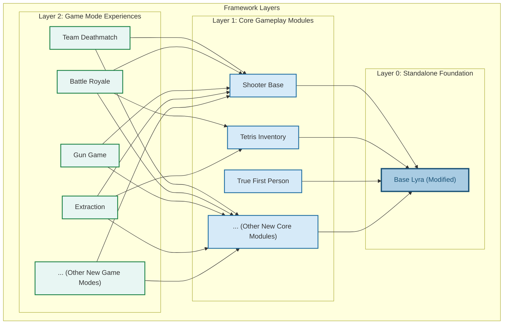

# Project Architecture

### **Overview of the Design Philosophy**

Before diving into the individual features, it's important to **understand how this framework is structured** and why it was designed this way.

This framework is built on **Lyra’s Game Features, Modular Gameplay, and Experience System**, allowing you to **mix and match features dynamically** rather than being locked into a rigid workflow.

By embracing a **composition-based design**, this system enables developers to build highly modular and scalable multiplayer shooters while balancing **performance (C++) and flexibility (Blueprints).**

This section provides a **high-level overview**—subsequent sections will **dive deeper into each system** so you can see how everything fits together.

#### **Key Principles**

* **Composition over inheritance** – Features are built as modular components rather than deep inheritance chains.
* **Opt-in systems** – Just about anything (player abilities, pawn components, UI, game mechanics, etc) can be selectively enabled or disabled, thanks to Lyra's experience systems.
* **Blueprint-friendly but C++-powered** – Core logic is in C++ for performance with blueprint-exposed functions, while Blueprints handle UI and gameplay tweaks.
* **Network-optimized** – Designed with multiplayer performance in mind (e.g., lag compensation, lightweight projectiles, replication optimizations).


**Hint:** If you're new to the concept of composition in game development, check out the video [_"Composition Over Inheritance"_](https://www.youtube.com/watch?v=HNzP1aLAffM). It provides a clear explanation of how this approach applies to Object-Oriented Programming in games.


***

### **C++ vs Blueprint Breakdown**

This framework takes a **hybrid approach**, using C++ for performance-critical systems while keeping Blueprints accessible for designers.

* **Performance-heavy features** (e.g., projectiles, networking, ability system) are in **C++**.
* **Designer-driven elements** (e.g., UI, customization options) remain in **Blueprints**.
* **Key functions are exposed** in Blueprints for easy modifications without touching C++.

***

### **Dependency Structure**

This framework is **layered**, meaning each level **depends only on the layers below it**.

🔹 **Base Lyra (Standalone)**\
🔹 **Core Modules (Depend on Base Lyra, they can also depend on each other if relevant)**\
🔹 **Game Modes (Depend on Core Modules, but not on each other)**






**Note:** These is just an example of the structure and **doesn't not indicate the actual dependency** for each game mode. When creating new **Game Modes** or **Core Gameplay Modules**, you determine the dependencies between different game features




```
[Base Lyra]  <- Independent, standalone  
  ├── [Shooter Base]  
  ├── [Tetris Inventory]  
  ├── [True First Person]
  ├── ... [New Core Modules]  
       ├── [Team Deathmatch]  
       ├── [Battle Royale]  
       ├── [Gun Game]  
       ├── [Extraction]  
       ├── ... [New Game Modes]
```


This shows a better understanding of the dependencies layers




💡 **Key Takeaways:**

* **Base Lyra is standalone** – It has been modified, but it doesn’t require additional modules.
* **Core Modules rely on Base Lyra** – They add mechanics like shooting, inventory, and true first-person controls.
* **Game Modes rely on Core Modules** – They determine the rules and gameplay experience but do not depend on each other.

#### **What This Means in Practice**

* **You can delete any game mode** (TDM, BR, Extraction) without breaking anything.
* **You can remove entire features** (e.g., the Inventory System) without affecting other systems. (**Note:** this would require **deleting** game modes depending on that core feature)
* **Game modes dynamically load only what they need** – No hardcoded dependencies

***

### **Modular & Extensible Design**

This framework is **built on a** [**modular gameplay approach**](../base-lyra-modified/gameframework-and-experience/game-features/), meaning **everything is opt-in**—you only include what you need.

#### **How This Works**

Each major system is designed as a **Game Feature Plugin**, meaning:&#x20;

* Game modes can selectively **enable or disable** specific features.
* New mechanics can be added **without modifying core classes**.
* Plugins can be updated independently **without breaking the entire project**.

#### **Examples of Modularity**

* The **Inventory System** doesn’t dictate the UI—you can build your own visual layer.
* The **Weapon System** allows new mechanics without modifying base weapon classes.
* The **Spawning System** dynamically adjusts based on **game mode conditions** (e.g., BR vs. TDM).

***

### **Experience System: The Core of Modularity**

The [**Experience System**](../base-lyra-modified/gameframework-and-experience/experience-primary-assets/) determines **what features, abilities, UI, and game logic** should be loaded per game mode.

#### **What It Controls**

🔹 **What abilities a character has**\
🔹 **What UI elements are enabled**\
🔹 **What components are spawned**\
🔹 **What inputs are enabled and their bindings**\
🔹 **Which plugins are active per game mode**

#### **Example Use Cases**

**1️⃣ Battle Royale & Extraction & TDM Inventory**

* BR: Players spawn with a grid inventory (similar to Apex legends) that they can interact with
* Extraction: Players spawn with a **full jigsaw inventory** (similar to Escape from Tarkov)
* TDM: Players spawn with a **very simple inventory** that they can't interact with

**2️⃣ Pawn-Specific Rules**

* Game mode defines **what pawn is used** (e.g., normal soldier vs. a prop in prop hunt).
* A horror game mode could introduce **new movement abilities** dynamically.

**3️⃣ Dynamic Spectating**

* A spectating system exists **only if a game mode enables it** (e.g., exists in BR but not in TDM).

💡 **Key Takeaway:** The Experience System **removes hard dependencies**—gameplay mechanics are defined per mode, not hardcoded into the player class.

***

## **Conclusion**

This framework is built **from the ground up for flexibility**, allowing developers to mix, match, and extend features without deep rewrites.

#### **Key Takeaways**

✅ **Game Feature Plugins** ensure modularity.\
✅ **The Experience System** enables dynamic gameplay configurations.\
✅ **C++ for performance, Blueprints for flexibility** keeps the framework accessible.\
✅ **Developers have full control** over what systems to include or exclude.
