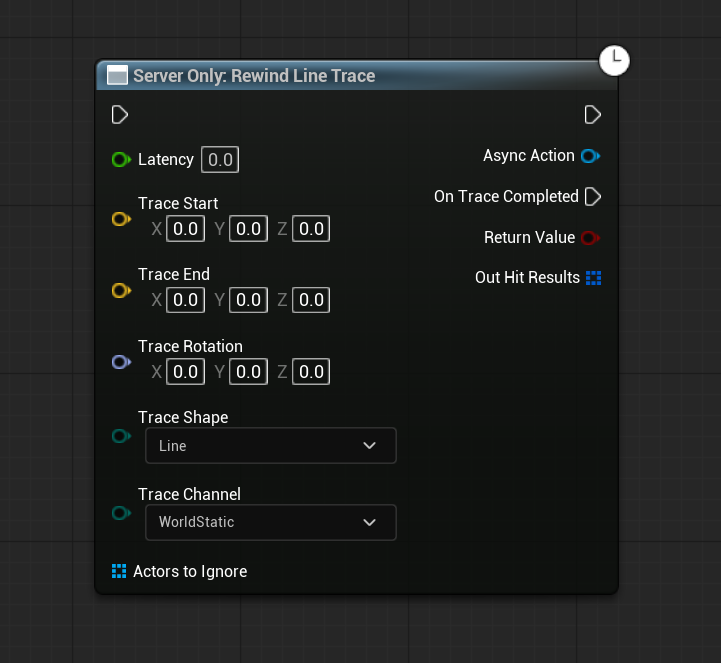

# Quick Start Guide

### **Your First Gameplay Session**

This guide walks you through launching your first gameplay session with the framework. You’ll play a prebuilt game mode, explore its assets, and make a simple customization—all while learning how the modular system works.


This guide assumes you've already completed the [Installing & Setup](installing-and-setup.md) steps and have the project open in Unreal Engine.


**By the end of this guide, you will have:**

1. Launch and play a prebuilt game mode
2. Locate the assets responsible for that game mode
3. Understand how Experiences and Game Features define gameplay
4. Make a small gameplay tweak safely
5. Know where to go next for deeper customization

Let's get started!

***

### **Launching an Example Game Mode**

Let's jump into a pre-built game mode to see the framework in action. We'll use **Team Deathmatch (TDM)** as an example.

1.  **Locate the TDM Map:**

    * In the Content Browser, make sure "Show Plugin Content" is enabled (Settings cogwheel in the Content Browser).
    * Navigate to the TDM plugin's content folder: `Plugins/GameFeatures/TeamDeathmatch/Content/Maps/`
    * Open the TDM map (`L_TeamDeatchmatch`)

    <figure><figcaption>
Team Death match map file and file path
</figcaption></figure>
2.  **Check World Settings (Informational):**

    * With the map open, go to **Window > World Settings**.
    * You'll see **Default Gameplay Experience** it should be set to an asset like `B_TeamDeathmatch` which defines what systems and features are loaded for this map.

    <figure><figcaption>
<em>World Settings panel showing the TDM Experience selected for the map</em>
</figcaption></figure>
3. **Play In Editor (PIE):**
   * Click the **Play** button in the main editor toolbar.
   * If prompted for the number of players, choose **1 or 2**.&#x20;
   * For multiplayer testing:
     * Use **"Play As Client"** to simulate server/client
     * Or use **"Play Standalone"** for a quick local test

You’re now playing the **Team Deathmatch** mode, powered by the framework’s modular components.

Observe:

* Scoring and team logic
* HUD behavior
* Pawn movement and abilities

***

### **Exploring the Team Deathmatch Assets (Initial Peek)**

Now that you've played it, let's briefly see where the TDM setup lives:

1. **Game Feature Plugin:** The TDM mode resides in its plugin folder (e.g., `Plugins/GameFeatures/TeamDeathmatch/`).
   * The `TeamDeathmatch.uplugin` file defines its dependencies (e.g., on `ShooterBase`, `LyraGame`). _This cannot be seen in the editor only in the file structure_. You can still set dependencies for the plugin in the editor through the game feature asset.
   * The `TeamDeathmatch` asset (in the plugin's root content folder) lists any plugin-wide actions, like `AddGameplayCuePath`.
2. **Experience Definition:** Inside the plugin's content (e.g., `Content/TeamDeathmatch/Experiences/`), find `B_TeamDeathmatch` .
   *   Open it to see:

       * **Game Features To Enable:** Likely `"TeamDeathmatch"` (itself, to ensure its actions and content are processed) and other dependencies like `"ShooterBase"`.
       * **Default Pawn Data:** The `ULyraPawnData` asset used for TDM players.
       * **Action Sets / Actions:** Any `ULyraExperienceActionSet`s it references or direct `UGameFeatureAction`s it uses (e.g., to add TDM scoring components or UI).

       <figure><figcaption>
<em><code>B_TeamDeathmatch</code> asset open, highlighting key properties.</em>
</figcaption></figure>

#### Other Useful Assets in the Plugin

* `HeroData_TeamDeathmatch` – Player configuration
* `B_Scoring_TeamDeathmatch` – Scoring logic
* `WBP_ScoreWidget_TeamDeathmatch` – Scoreboard UI

All TDM-specific logic and assets are contained in the TDM plugin.\
It depends on shared systems like ShooterBase, but no other plugin depends on TDM. This makes it safe to modify or remove without impacting the rest of the framework.

***

### **Making a Small Tweak:**

Let’s change a rule or component for learning purposes.

Modify the `B_Scoring_TDM` or `W_ScoreWidget_TeamDeathmatch` blueprint in the TDM plugin’s `Game` folder.

This lets you experiment without breaking core functionality. Feel free to adjust:

* Score values
* Win conditions
* UI elements


While it’s fine to experiment here, remember that the recommended way to make lasting changes is to duplicate assets into your own Game Feature Plugin.\
This helps avoid conflicts and makes updates easier.\
If you haven't already, see the [Installing & Setup](installing-and-setup.md) guide for how to set this up properly.


***

### **Next Steps: Diving Deeper**

You've now launched a game mode! This framework is extensive. Here’s where to go to learn more and start building your vision:

* **Understand the Foundation - Experiences & Game Features:**
  * This is how all game modes and modular content are structured. Mastering this is key.
  * **➡️** [**See Full Documentation: Game Framework & Experiences**](../base-lyra-modified/gameframework-and-experience/).
* **Explore Core Gameplay Plugins:**
  * **ShooterBase:** For all things combat.
    * **Key Features:** Compositional weapon system, predictive recoil, diverse projectile types (hitscan, simulated bullet drop), lag compensation, aim assist, intelligent spawning, flexible scoring, spectator system, killcam, accolades.
    * **Dive In:** Learn how to define new weapons, tweak firing mechanics, or customize the spawn system.
    * **➡️** [**See ShooterBase Documentation**](../core-modules/shooter-base/)
  * **Tetris Inventory:** For advanced, spatial inventory management.
    * **Key Features:** Grid-based layouts, items with defined shapes, item rotation, container items with nested Tetris inventories, 3D item inspection.
    * **Dive In:** Learn how to define item shapes, create grid containers, and manage items spatially.
    * **➡️** [**See Tetris Inventory Documentation**](../core-modules/tetris-inventory/)
  * **True First Person:** For an immersive first-person perspective.
    * **Key Features:** Full-body awareness, seamless first/third-person transitions (if supported), weapon animations synced with the first-person view.
    * **Dive In:** Understand how to set up character meshes and animations for true FPS.
    * **➡️** [**See True First Person Documentation**](../core-modules/true-first-person.md)
* **Leverage Base Lyra (Modified) Systems:**
  * This asset extends and utilizes many core Lyra concepts. Understanding these is beneficial:
    * **Character System:** How pawns are built with components, GAS integration, movement. ([See Character System Docs](../base-lyra-modified/character/))
    * **Item/Inventory System (Base):** The foundational item definitions, instances, fragments, permissions, GAS integration, and pickup system, which `TetrisInventory` builds upon. ([See Inventory System Docs](../base-lyra-modified/items/))
    * **Equipment System:** How items (especially weapons) are equipped, grant abilities, and manage their runtime instances. ([See Equipment System Docs](../base-lyra-modified/equipment/))
    * **Team System:** Defining teams, assigning players, and managing team visuals. ([See Team System Docs](../base-lyra-modified/team/))
    * **Interaction System:** How players interact with objects in the world using GAS. ([See Interaction System Docs](../base-lyra-modified/interaction/))
    * **Cosmetic System:** Dynamically changing pawn appearance with character parts. ([See Cosmetic System Docs](../base-lyra-modified/cosmetics/))
    * **Game Phase System:** Managing the stages of a game session (e.g., warmup, playing, round end) using GAS and tags. ([See Game Phase System Docs](../base-lyra-modified/game-phase-system/))
    * **Camera System:** Flexible camera modes and stack-based blending. ([See Camera System Docs](../base-lyra-modified/camera/))
    * **Input System:** How Enhanced Input and Lyra Input Configs drive actions and abilities. ([See Input System Docs](../base-lyra-modified/input/))
    * **Settings System:** Player and machine-specific settings management. ([See Settings System Docs](../base-lyra-modified/settings/))
* **Creating Your Own Game Mode:**
  * Once you're familiar with the concepts, follow the detailed guide: [**Creating a New Game Mode (Practical Guide)**](../game-modes/extending-and-customization/creating-new-game-modes/).
* **Analyze Example Game Modes:**
  * Each included game mode plugin (Arena, Battle Royale, Capture The Flag, Domination, Extraction, Free For All, Gun Game, Hardpoint, Headquarters, Infection, Kill Confirmed, Payload, Prop Hunt, Search & Destroy) in `Plugins/GameFeatures/` showcases different ways to combine these systems.
  * **For example:**
    * **Extraction & Battle Royale:** Demonstrate different scales of inventory usage (BR is simpler, Extraction uses the full Tetris system).
    * **Arena:** Shows character selection and a buy menu.
    * **Prop Hunt & Infection:** Illustrate asymmetric team setups.
    * **Gun Game:** Highlights using Gameplay Events to drive game progression.
    * **Headquarters:** Demonstrates advanced respawn logic.
  * Inspect their Experience Definitions, Action Sets, and specific components to learn advanced setup patterns.
* **Experiment & Iterate:** The best way to master the framework is to create your own Game Feature Plugin, duplicate assets into it, and start tweaking.
