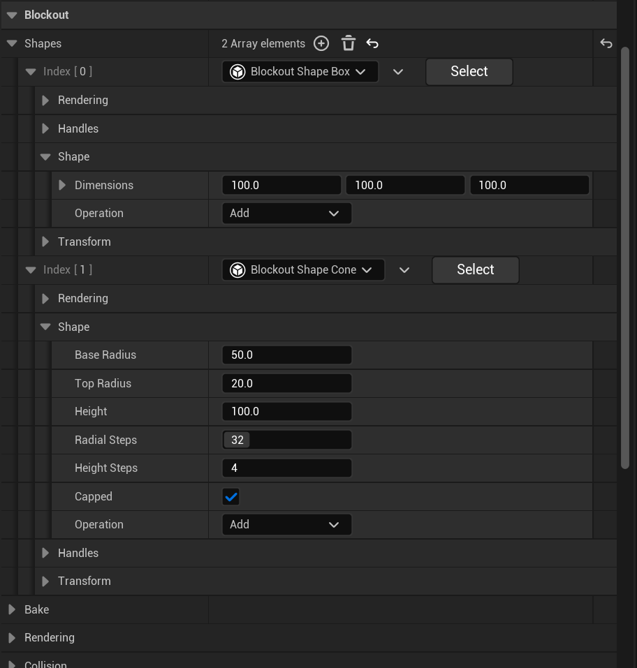

# Quick Start Guide

### **Your First Gameplay Session**

Welcome! This guide is designed to get you up and running quickly with the framework. It assumes you've already installed the asset and opened the project in Unreal Engine, as outlined in the "Installation & Setup" guide.

**By the end of this guide, you will have:**

1. Understood the basic project and plugin structure.
2. Launched and played one of the pre-built example game modes.
3. Learned where to find the assets related to that game mode for initial exploration.
4. Known where to go next for deeper learning and customization.

Let's get started!

***

### **Understanding the Project Structure**

Before diving in, a quick look at where things are:

* `📂 Content/`
  * Contains core assets and any modified Lyra framework code. **Generally, avoid modifying these directly to ensure easier updates.**
* `📂 Plugins/`
  * This is a standard Unreal Engine plugins directory.
* `📂 Plugins/GameFeatures/`
  * **This is the primary location for modular content.** Each subdirectory here is a separate **Game Feature Plugin**.
  * **Core Framework Plugins:** You'll find the foundational plugins of this asset here (e.g., `ShooterBase/`, `TetrisInventory/`, `TrueFirstPerson/`).
  * **Example Game Mode Plugins:** The pre-built game modes (e.g., `TeamDeathmatch/`, `Arena/`, `BattleRoyale/`) also reside here as individual Game Feature Plugins.
  * **Your Custom Plugins:** When you create new game modes or features, they will also become subdirectories in `Plugins/GameFeatures/`.

**Core Philosophy:** This framework is built on modularity using **Game Feature Plugins** and **Experiences**.

* **Game Feature Plugins:** Package distinct gameplay systems (core mechanics or specific game modes). Their dependencies on other plugins are defined in their respective `.uplugin` files.
* **Experiences (`ULyraExperienceDefinition`):** Data Assets (usually found within a Game Feature Plugin's `Content` folder) that define _what_ game mode to run, _which_ Game Features to activate for that session, default player setups, and UI.


### Best Practice: Working with the Framework

If you're just getting started with Unreal Engine or aren't yet comfortable managing complex changes in large codebases (especially when it comes to using Git for merging and tracking changes), **please follow the recommended customization paths** below to keep your project clean and easy to update.

#### Recommended Way to Customize

* **Add Major Features / New Game Modes / Big Changes**\
  Create a **new Game Feature Plugin** for your content. This keeps your work separate from the core framework and example content, making updates smoother and easier to manage.
*   **Tweak Example Game Modes**\
    If you want to build on an existing example:

    1. Create a new Game Feature Plugin.
    2. Copy any relevant assets (like `ULyraExperienceDefinition`, `ULyraPawnData`, `ULyraExperienceActionSets`) from the example plugin.
    3. Modify those copies in your plugin.

    This approach ensures the original examples stay untouched, making it easier to compare, learn from, or update them later.

#### Modifying the Core Framework (ShooterBase, TetrisInventory, etc.)

The core plugins are designed to be extended—not edited directly. If you modify them, you’re entering “merge conflict territory,” and future updates will be harder to apply.

#### A Word to Experienced Developers

If you're comfortable with Unreal's systems and Git workflows, and you truly need to change something deep in the core systems that can’t be handled through subclassing, configuration, or Game Features—go for it. But understand:

* **You’re now responsible** for manually merging changes when updating this asset pack.
* Modifying core systems is a valid choice for advanced use cases, but it requires a solid understanding of Unreal's architecture and version control workflows. If that’s not familiar territory, it’s best to stick with extension-based methods to avoid potential maintenance headaches

In short: **extend, don’t edit—unless you know exactly what you're doing.**


***

### **Launching an Example Game Mode**

Let's jump into a pre-built game mode to see the framework in action. We'll use **Team Deathmatch (TDM)** as an example.

1.  **Locate the TDM Map:**

    * In the Content Browser, make sure "Show Plugin Content" is enabled (Settings cogwheel in the Content Browser).
    * Navigate to the TDM plugin's content folder: `Plugins/GameFeatures/TeamDeathmatch/Content/Maps/`
    * Open a TDM map.

    <figure><figcaption>
Team Death match map file and file path
</figcaption></figure>
2.  **Check World Settings (Informational):**

    * With the map open, go to Window > World Settings.
    * You'll see `Default Gameplay Experience` is likely set to something like `B_TeamDeathmatch`. This Experience Definition asset would be located within the `TeamDeathmatch` plugin's content, in the `Experiences` subfolder.

    <figure><figcaption>
<em>World Settings panel showing the TDM Experience selected for the map</em>
</figcaption></figure>
3. **Play In Editor (PIE):**
   * Click the "Play" button in the main editor toolbar.
   * If prompted for the number of players, choose 1 or 2 for now. Set "Net Mode" to "Play As Listen Server" if you want to test server/client, or "Play Standalone" for a quick single-player test.
4. **Experience Gameplay:**
   * You should now be in the Team Deathmatch game mode. Observe the HUD, team assignments, and gameplay.

***

### **Exploring the Team Deathmatch Assets (Initial Peek)**

Now that you've played it, let's briefly see where the TDM setup lives:

1. **Game Feature Plugin:** The TDM mode resides in its plugin folder (e.g., `Plugins/GameFeatures/TeamDeathmatch/`).
   * The `TeamDeathmatch.uplugin` file defines its dependencies (e.g., on `ShooterBase`, `LyraGame`). _This cannot be seen in the editor only in the file structure_. You can still set dependencies for the plugin in the editor through the game feature asset.
   * The `TeamDeathmatch` asset (in the plugin's root content folder) lists any plugin-wide actions, like `AddGameplayCuePath`.
2. **Experience Definition:** Inside the plugin's content (e.g., `Content/TeamDeathmatch/Experiences/`), find `B_TeamDeathmatch` .
   *   Open it to see:

       * **Game Features To Enable:** Likely `"TeamDeathmatch"` (itself, to ensure its actions and content are processed) and other dependencies like `"ShooterBase"`.
       * **Default Pawn Data:** The `ULyraPawnData` asset used for TDM players.
       * **Action Sets / Actions:** Any `ULyraExperienceActionSet`s it references or direct `UGameFeatureAction`s it uses (e.g., to add TDM scoring components or UI).

       <figure><figcaption>
<em><code>B_TeamDeathmatch</code> asset open, highlighting key properties.</em>
</figcaption></figure>
3. **Pawn Data, Mode-Specific Components/Widgets:** All other assets specific to TDM (like `PawnData_TDM_Default`, `GSC_TeamDeathmatchScore`, `WBP_TDM_Scoreboard`) will be within the `Content` folder of the `TeamDeathmatch` Game Feature Plugin.

**Making a Small Tweak (Example):**

* Try modifying the experience blueprint `B_Deathmatch` or `B_Scoring_TDM` in the Game folder for TDM rules.


For the purposes of this quick start, it's okay to modify existing game mode assets directly to get a feel for how things work.\
However, when you're ready to implement new features or systems in a real project, it's strongly recommended to create your own Game Feature Plugin and duplicate the relevant assets. This keeps your project clean, modular, and update-friendly.


***

### **Next Steps: Diving Deeper**

You've now launched a game mode! This framework is extensive. Here’s where to go to learn more and start building your vision:

* **Understand the Foundation - Experiences & Game Features:**
  * This is how all game modes and modular content are structured. Mastering this is key.
  * **➡️ See Full Documentation: Game Framework & Experiences** (This will cover Experience Definitions, Action Sets, User Facing Experiences, Game Feature Actions, and how core classes like GameMode/GameState integrate).
* **Explore Core Gameplay Plugins:**
  * **ShooterBase:** For all things combat.
    * **Key Features:** Compositional weapon system, predictive recoil, diverse projectile types (hitscan, simulated bullet drop), lag compensation, aim assist, intelligent spawning, flexible scoring, spectator system, killcam, accolades.
    * **Dive In:** Learn how to define new weapons, tweak firing mechanics, or customize the spawn system.
    * **➡️** [**See ShooterBase Documentation**](../core-modules/shooter-base/)
  * **Tetris Inventory:** For advanced, spatial inventory management.
    * **Key Features:** Grid-based layouts, items with defined shapes, item rotation, container items with nested Tetris inventories, 3D item inspection.
    * **Dive In:** Learn how to define item shapes, create grid containers, and manage items spatially.
    * **➡️** [**See Tetris Inventory Documentation**](../core-modules/tetris-inventory/)
  * **True First Person:** For an immersive first-person perspective.
    * **Key Features:** Full-body awareness, seamless first/third-person transitions (if supported), weapon animations synced with the first-person view.
    * **Dive In:** Understand how to set up character meshes and animations for true FPS.
    * **➡️** [**See True First Person Documentation**](../core-modules/true-first-person.md)
* **Leverage Base Lyra (Modified) Systems:**
  * This asset extends and utilizes many core Lyra concepts. Understanding these is beneficial:
    * **Character System:** How pawns are built with components, GAS integration, movement. ([See Character System Docs](../base-lyra-modified/character/))
    * **Item/Inventory System (Base):** The foundational item definitions, instances, fragments, permissions, GAS integration, and pickup system, which `TetrisInventory` builds upon. ([See Inventory System Docs](../base-lyra-modified/items/))
    * **Equipment System:** How items (especially weapons) are equipped, grant abilities, and manage their runtime instances. ([See Equipment System Docs](../base-lyra-modified/equipment/))
    * **Team System:** Defining teams, assigning players, and managing team visuals. ([See Team System Docs](../base-lyra-modified/team/))
    * **Interaction System:** How players interact with objects in the world using GAS. ([See Interaction System Docs](../base-lyra-modified/interaction/))
    * **Cosmetic System:** Dynamically changing pawn appearance with character parts. ([See Cosmetic System Docs](../base-lyra-modified/cosmetics/))
    * **Game Phase System:** Managing the stages of a game session (e.g., warmup, playing, round end) using GAS and tags. ([See Game Phase System Docs](../base-lyra-modified/game-phase-system/))
    * **Camera System:** Flexible camera modes and stack-based blending. ([See Camera System Docs](../base-lyra-modified/camera/))
    * **Input System:** How Enhanced Input and Lyra Input Configs drive actions and abilities. ([See Input System Docs](../base-lyra-modified/input/))
    * **Settings System:** Player and machine-specific settings management. ([See Settings System Docs](../base-lyra-modified/settings/))
* **Creating Your Own Game Mode:**
  * Once you're familiar with the concepts, follow the detailed guide: [**Creating a New Game Mode (Practical Guide)**](../game-modes/extending-and-customization/creating-new-game-modes/).
* **Analyze Example Game Modes:**
  * Each included game mode plugin (Arena, Battle Royale, Capture The Flag, Domination, Extraction, Free For All, Gun Game, Hardpoint, Headquarters, Infection, Kill Confirmed, Payload, Prop Hunt, Search & Destroy) in `Plugins/GameFeatures/` showcases different ways to combine these systems.
  * **For example:**
    * **Extraction & Battle Royale:** Demonstrate different scales of inventory usage (BR is simpler, Extraction uses the full Tetris system).
    * **Arena:** Shows character selection and a buy menu.
    * **Prop Hunt & Infection:** Illustrate asymmetric team setups.
    * **Gun Game:** Highlights using Gameplay Events to drive game progression.
    * **Headquarters:** Demonstrates advanced respawn logic.
  * Inspect their Experience Definitions, Action Sets, and specific components to learn advanced setup patterns.
* **Experiment & Iterate:** The best way to master the framework is to create your own Game Feature Plugin, duplicate assets into it, and start tweaking.
